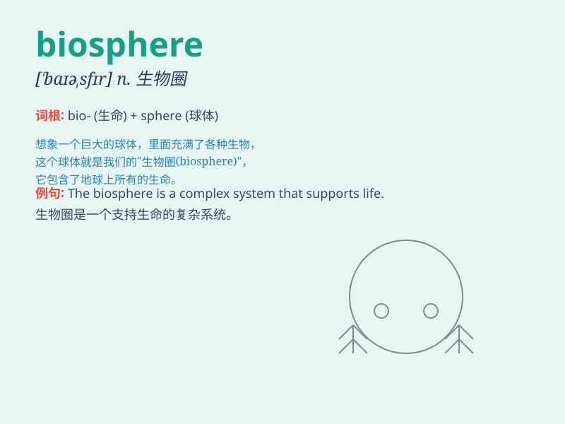

## biosphere

**英音:** _[\'baɪə(ʊ)sfɪə]_ **美音:** _[\'baɪosfɪr]_

**译义:** *n.生物圈*

### 短语

+ **biosphere reserve:** _生物圈保护区_

+ **global biosphere:** _全球生物圈_

+ **marine biosphere:** _海洋生物圈_

+ **terrestrial biosphere:** _陆地生物圈_

+ **biosphere dynamics:** _生物圈动态_

### 例句

#### 例句1

> **The biosphere is a complex and delicate system that supports life
on Earth.**

**中文翻译:** 生物圈是一个复杂而微妙的系统，支撑着地球上的生命。

**单词释义:** 生物圈

#### 例句2

> **Human activities have had a significant impact on the
biosphere.**

**中文翻译:** 人类活动对生物圈产生了重大影响。

**单词释义:** 生物圈

#### 例句3

> **Scientists are studying ways to protect the biosphere from
further damage.**

**中文翻译:** 科学家们正在研究保护生物圈免受进一步破坏的方法。

**单词释义:** 生物圈

### 背诵小故事

> Imagine a huge bubble protecting all living things on Earth. This
bubble is the biosphere. It includes land, water, and air where plants,
animals, and humans exist and interact. Just like a magical shield for
life!

**想象一个巨大的泡泡保护着地球上所有的生物。这个泡泡就是生物圈。它包括陆地、水和空气，植物、动物和人类在其中生存和相互作用。就像一个生命的神奇护盾！**

### 图义

