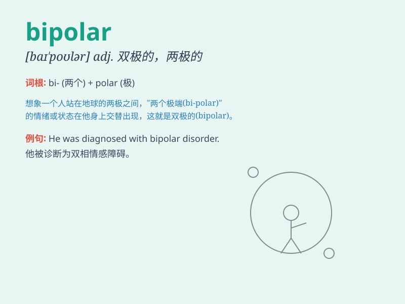

## bipolar

**英音:** _[baɪ\'pəʊlə]_ **美音:** _[,baɪ\'polɚ]_

**译义:** *adj.有两极的,双极的*

### 短语

+ **bipolar disorder:** _双相情感障碍；躁郁症_

+ **bipolar neuron:** _双极神经元_

+ **bipolar world:** _两极世界_

+ **bipolar semiconductor:** _双极型半导体_

+ **bipolar pulse:** _双极性脉冲_

### 例句

#### 例句1

> **She was diagnosed with bipolar disorder.**

**中文翻译:** 她被诊断患有双相情感障碍。

**单词释义:** 双相的；躁狂抑郁性精神病的

#### 例句2

> **The bipolar world of the Cold War era has long ended.**

**中文翻译:** 冷战时代的两极世界早已结束。

**单词释义:** 有两极的；双极的

#### 例句3

> **The bipolar magnet has strong magnetic force.**

**中文翻译:** 双极磁铁具有很强的磁力。

**单词释义:** 双极的

### 背诵小故事

> A person was struggling with mood swings. One day, a doctor told him
he had bipolar disorder. It means having two extreme moods, like extreme
happiness and extreme sadness. Now he understood his condition better.

**一个人一直被情绪波动所困扰。有一天，医生告诉他患有双相情感障碍。这意味着有两种极端的情绪，像极度快乐和极度悲伤。现在他更了解自己的状况了。**

### 图义

