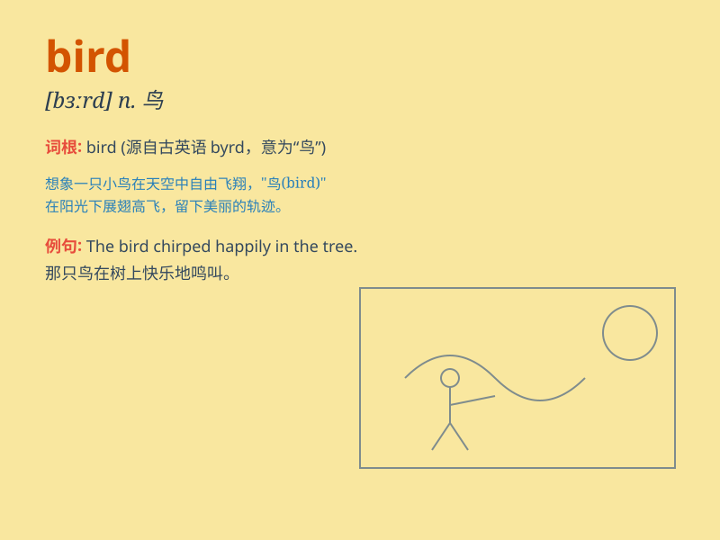

## bird

**英音:** _[bɜːd]_ **美音:** _[bɝd]_

**译义:** *n.鸟,\<俚>人vi.在野外观察或鉴别鸟类*

### 短语

+ **bird\'s eye view:** _鸟瞰；概览_

+ **early bird:** _早起的人；早到者_

+ **for the birds:** _毫无意义的；荒唐可笑的_

+ **a little bird told me:** _（表示不想说出消息来源）有人跟我说_

+ **birds of a feather:** _一丘之貉；物以类聚_

### 例句

#### 例句1

> **The bird is singing in the tree.**

**中文翻译:** 小鸟在树上唱歌。

**单词释义:** 鸟

#### 例句2

> **I saw a beautiful bird in the park yesterday.**

**中文翻译:** 昨天我在公园里看到一只美丽的鸟。

**单词释义:** 鸟

#### 例句3

> **The early bird catches the worm.**

**中文翻译:** 早起的鸟儿有虫吃。

**单词释义:** 鸟

### 背诵小故事

> One sunny day, a little boy was playing in the park. Suddenly, a
beautiful bird flew by. It had colorful feathers and sang a sweet song.
The boy was so amazed and wanted to be as free as the bird.

**在一个阳光明媚的日子，一个小男孩在公园玩耍。突然，一只漂亮的鸟飞过。它有着五彩的羽毛，唱着甜美的歌。男孩十分惊奇，渴望能像这只鸟一样自由。**

### 图义

