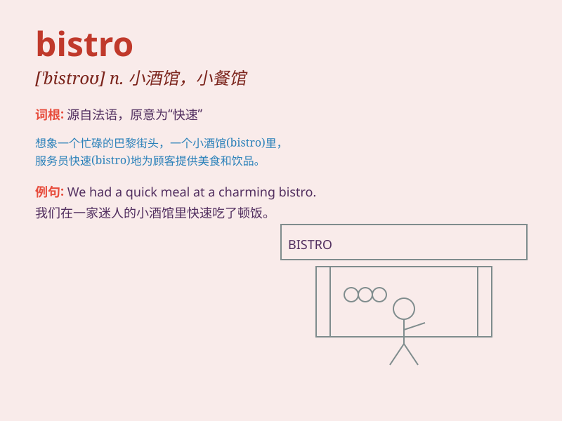

## bistro

**英音:** _[\'biːstrəʊ; \'bɪs-]_ **美音:** _[\'bistro]_

**译义:** *n.\<俗>小酒馆,小咖啡店,酒馆跑堂者*

### 短语

+ **French bistro:** _法式小餐馆_

+ **neighborhood bistro:** _社区小酒馆_

+ **cozy bistro:** _舒适的小餐馆_

+ **charming bistro:** _迷人的小酒馆_

+ **upscale bistro:** _高档的小餐馆_

### 例句

#### 例句1

> **We discovered a charming little bistro in the side street.**

**中文翻译:** 我们在小街上发现了一家迷人的小酒馆。

**单词释义:** 小餐馆

#### 例句2

> **The bistro was filled with the aroma of freshly baked bread.**

**中文翻译:** 小酒馆里充满了新鲜出炉的面包的香味。

**单词释义:** 小餐馆

#### 例句3

> **They decided to have dinner at a local bistro instead of a fancy
restaurant.**

**中文翻译:** 他们决定在当地的小酒馆而不是高档餐厅吃晚餐。

**单词释义:** 小餐馆

### 背诵小故事

> A hungry traveler was lost in a strange town. Just when he was about
to give up, he found a small bistro. The warm lights and delicious
smells drew him in. He had a wonderful meal and felt happy.

**一位饥饿的旅行者在一个陌生的城镇迷路了。就在他快要放弃的时候，他发现了一家小餐馆。温暖的灯光和美味的香气吸引着他进去。他享用了一顿美餐，感到很开心。**

### 图义

