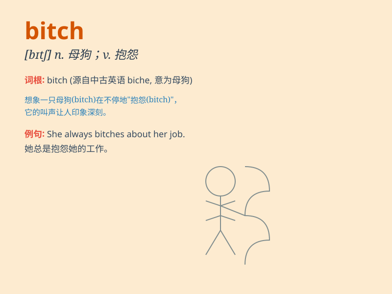

## bitch

**英音:** _[bɪtʃ]_ **美音:** _[bɪtʃ]_

**译义:** *n.母狗,母狼,母狐,\<俚>婊子*

### 短语

+ **son of a bitch:** _用于辱骂某人，意思是'狗娘养的'_

+ **bitch about:** _抱怨，发牢骚_

+ **bitch slap:** _打耳光_

+ **lazy bitch:** _懒婆娘_

+ **mean bitch:** _刻薄的女人_

### 例句

#### 例句1

> **She\'s such a bitch when she doesn\'t get her way.**

**中文翻译:** 当她不按自己的方式行事时，她真是个混蛋。

**单词释义:** 脾气坏的女人

#### 例句2

> **Don\'t be a bitch about it.**

**中文翻译:** 别为此发脾气。

**单词释义:** 发牢骚的人

#### 例句3

> **That bitch of a boss makes us work overtime every day.**

**中文翻译:** 那个王八蛋的老板让我们天天加班。

**单词释义:** 可恶的人

### 背诵小故事

> A man was walking in the forest and suddenly saw a female dog barking
angrily. He shouted, \'This angry bitch!\' From then on, he remembered
that \'bitch\' means a female dog, and it can also be used rudely to
describe a bad-tempered woman.

**一个男人在森林里走着，突然看到一只母狗在愤怒地叫。他喊道：'这只愤怒的母狗！'从那以后，他记住了'bitch'指母狗，也可用于粗鲁地形容脾气坏的女人。**

### 图义

