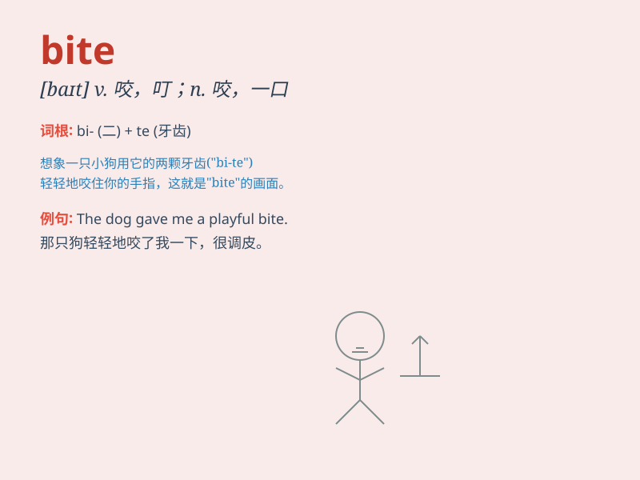

## bite

**英音:** _[baɪt]_ **美音:** _[baɪt]_

**译义:** *vt.咬；叮；刺痛 n.咬；咬伤；一小块食物 vi.咬；刺痛*

### 短语

+ **bite off more than one can chew:**
_贪多嚼不烂；承担力所不及的事_

+ **bite the bullet:** _咬紧牙关；忍受困难或痛苦_

+ **have a bite to eat:** _随便吃点东西_

+ **bite one\'s tongue:** _忍住不说；保持缄默_

+ **a bite to drink:** _少量喝的东西_

### 例句

#### 例句1

> **The dog bit the thief\'s leg.**

**中文翻译:** 这只狗咬了小偷的腿。

**单词释义:** 咬

#### 例句2

> **This apple has a bite taken out of it.**

**中文翻译:** 这个苹果被咬了一口。

**单词释义:** 咬；一口

#### 例句3

> **The fish might bite if you are not careful.**

**中文翻译:** 如果你不小心，鱼可能会咬你。

**单词释义:** 咬

### 背诵小故事

> One day, a little mouse was very hungry. It saw a big piece of cheese
and decided to bite it. But as it bit, a trap was triggered! Poor mouse.
Remember, \'bite\' means to use your teeth to cut into something.

**有一天，一只小老鼠非常饿。它看到一大块奶酪，决定咬一口。但当它咬的时候，触发了一个陷阱！可怜的老鼠。记住，\'bite\'意思是用牙齿切入某物。**

### 图义

