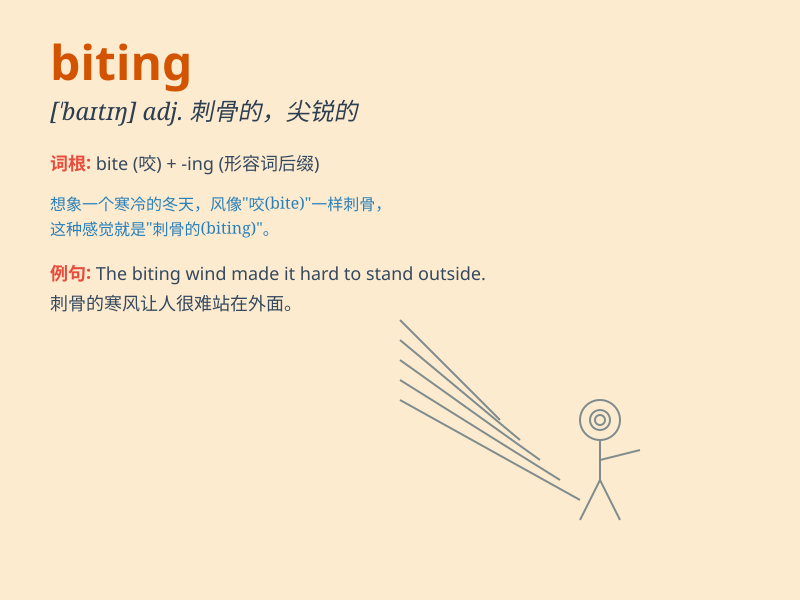

## biting

**英音:** _[\'baɪtɪŋ]_ **美音:** _[\'baɪtɪŋ]_

**译义:** *adj.刺痛的,尖锐的*

### 短语

+ **biting wind:** _刺骨的风_

+ **biting cold:** _严寒_

+ **biting criticism:** _尖锐的批评_

+ **biting satire:** _辛辣的讽刺_

+ **biting remark:** _尖刻的话_

### 例句

#### 例句1

> **The biting wind made it difficult to stay outside for long.**

**中文翻译:** 凛冽的寒风让人很难在外面久留。

**单词释义:** 刺骨的；刺痛的

#### 例句2

> **She made a biting comment about his poor performance.**

**中文翻译:** 她对他糟糕的表现作出了尖锐的评论。

**单词释义:** 尖刻的；辛辣的

#### 例句3

> **The dog has a biting habit that needs to be corrected.**

**中文翻译:** 狗有咬人的习惯，需要纠正。

**单词释义:** 咬人的；会咬的

### 背诵小故事

> One cold winter day, a little mouse was looking for food. Suddenly, a
snake appeared with a biting mouth. The mouse was so scared. It ran away
quickly. The snake\'s biting teeth were very sharp.

**在一个寒冷的冬日，一只小老鼠正在寻找食物。突然，一条蛇出现了，张着咬人的嘴。小老鼠非常害怕。它迅速跑开了。这条蛇咬人的牙齿非常锋利。**

### 图义

