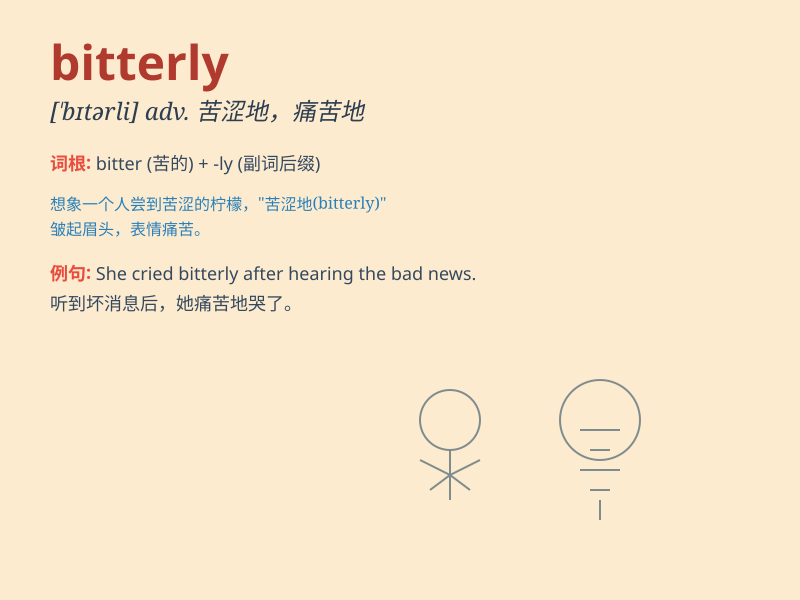

## bitterly

**英音:** _[\'bɪtəlɪ]_ **美音:** _[\'bɪtɚli]_

**译义:** *adv.苦苦地,悲痛的,厉害的*

### 短语

+ **bitterly cold:** _严寒的；冰冷刺骨的_

+ **bitterly disappointed:** _极度失望的_

+ **bitterly regret:** _深感懊悔；痛苦地后悔_

+ **bitterly complain:** _痛苦地抱怨；愤恨地诉苦_

+ **bitterly opposed:** _强烈反对_

### 例句

#### 例句1

> **She wept bitterly when she heard the news.**

**中文翻译:** 当她听到这个消息时，痛哭起来。

**单词释义:** 悲痛地

#### 例句2

> **It was bitterly cold outside.**

**中文翻译:** 外面寒冷刺骨。

**单词释义:** 非常；极其

#### 例句3

> **He complained bitterly about the injustice.**

**中文翻译:** 他对这种不公正现象提出了严厉的抱怨。

**单词释义:** 愤怒地；怨恨地

### 背诵小故事

> A man lost his job and had to walk home in the cold winter. He felt
bitterly disappointed. Tears froze on his cheeks as he thought about his
uncertain future.

**一个男人丢了工作，不得不在寒冷的冬天步行回家。他感到极度失望。当他想到不确定的未来时，泪水在他的脸颊上冻住了。**

### 图义

