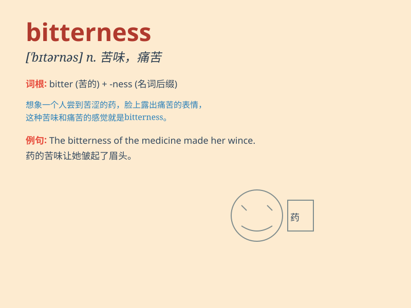

## bitterness

**英音:** _[bɪtənəs]_ **美音:** _[\'bɪtɚnɪs]_

**译义:** *n.苦味,辛酸,苦难*

### 短语

+ **bitter taste:** _苦味_

+ **bitter cold:** _严寒_

+ **bitter experience:** _痛苦的经历_

+ **bitter quarrel:** _激烈的争吵_

+ **bitter enemy:** _死敌_

### 例句

#### 例句1

> **The bitterness of the coffee was too intense for her.**

**中文翻译:** 咖啡的苦味对她来说太浓了。

**单词释义:** 苦味

#### 例句2

> **He spoke of the bitterness of his divorce.**

**中文翻译:** 他谈到了离婚的痛苦。

**单词释义:** 痛苦

#### 例句3

> **The years of hardship left a residue of bitterness in her
heart.**

**中文翻译:** 多年的艰辛，在她的心里留下了一丝苦涩。

**单词释义:** 怨恨

### 背诵小故事

> A poor man was constantly facing hardships and setbacks. The taste of
life for him was full of bitterness. He felt like he was trapped in a
dark cave with no way out. But he didn\'t give up and finally found a
way to happiness.

**一个穷人不断面临艰难和挫折。对他来说，生活的滋味充满了苦涩。他觉得自己被困在一个黑暗的洞穴里，无路可走。但他没有放弃，最终找到了通往幸福的路。**

### 图义

