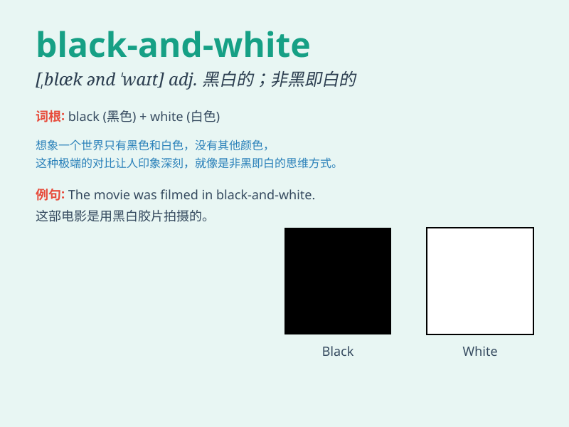

## black-and-white

**英音:** _[blækændˈwaɪt]_ **美音:** _[blækəndˈwaɪt]_

**译义:** *adj. 黑白的；明辨是非的；n. 黑白片；黑白两色；adv.
明确地；毫不含糊地*

### 短语

+ **black-and-white photography:** _黑白摄影_

+ **black-and-white thinking:** _非黑即白的思维方式_

+ **black-and-white film:** _黑白电影_

+ **black-and-white television:** _黑白电视机_

+ **black-and-white print:** _黑白印刷品_

### 例句

#### 例句1

> **The movie was presented in black-and-white, giving it a classic
look.**

**中文翻译:** 这部电影以黑白形式呈现，给它一种经典的外观。

**单词释义:** 黑白的

#### 例句2

> **She has a very black-and-white view of the world; things are
either right or wrong.**

**中文翻译:**
她对世界的看法非常非黑即白；事情要么是对的，要么是错的。

**单词释义:** 非黑即白的；绝对化的

#### 例句3

> **The old photographs were black-and-white, but they still captured
precious moments.**

**中文翻译:** 这些老照片是黑白的，但它们仍然捕捉到了珍贵的时刻。

**单词释义:** 黑白的

### 背诵小故事

> Once upon a time, there was a magic painting. It was black-and-white.
It showed a simple but beautiful world. People could easily understand
its meaning. It was like a clear story without any confusion.

**从前，有一幅神奇的画。它是黑白的。它展示了一个简单而美丽的世界。人们可以很容易地理解它的意思。它就像一个清晰的故事，没有任何混乱。**

### 图义

