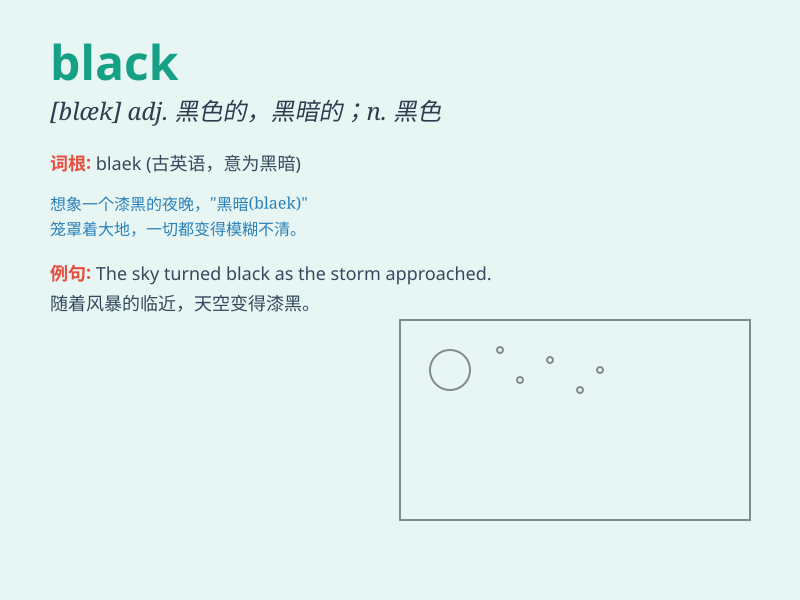

## black

**英音:** _[blæk]_ **美音:** _[blæk]_

**译义:**
*n.黑色,黑颜料,黑人adj.黑色的,弄脏了的,忧郁的vt.(使)变黑,涂黑*

### 短语

+ **black and white:** _黑白的；是非分明的_

+ **black sheep:** _害群之马；败家子_

+ **black list:** _黑名单_

+ **black tea:** _红茶_

+ **in black:** _穿着黑色衣服_

### 例句

#### 例句1

> **The black cat is very cute.**

**中文翻译:** 黑猫非常可爱。

**单词释义:** 黑色的

#### 例句2

> **She was dressed in black.**

**中文翻译:** 她穿着黑色衣服。

**单词释义:** 黑色的

#### 例句3

> **He has a black heart.**

**中文翻译:** 他有一颗黑心。

**单词释义:** 邪恶的

### 背诵小故事

> One night, I was walking in a dark forest. Everything was black.
Suddenly, a black cat crossed my path. It was so scary! I realized black
means the absence of light and often associated with mystery and fear.

**一天晚上，我在一片黑暗的森林里散步。一切都是黑色的。突然，一只黑猫穿过我的路。太可怕了！我意识到
black 表示没有光，通常与神秘和恐惧相关。**

### 图义

