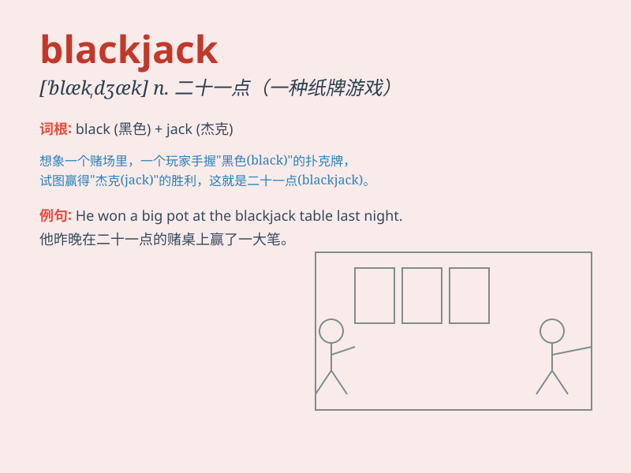

## blackjack

**英音:** _[\'blækdʒæk]_ **美音:** _[\'blæk\'dʒæk]_

**译义:** *v.以棒打,胁迫n.扑克牌的二十一点*

### 短语

+ **play blackjack:** _玩 21 点纸牌游戏_

+ **blackjack dealer:** _21 点纸牌游戏发牌员_

+ **win at blackjack:** _在 21 点纸牌游戏中获胜_

+ **blackjack table:** _21 点纸牌游戏桌_

+ **learn blackjack:** _学习 21 点纸牌游戏_

### 例句

#### 例句1

> **The dealer was skilled at blackjack.**

**中文翻译:** 庄家擅长玩二十一点。

**单词释义:** 二十一点（一种纸牌游戏）

#### 例句2

> **He lost a lot of money playing blackjack at the casino.**

**中文翻译:** 他在赌场玩二十一点输了很多钱。

**单词释义:** 二十一点（一种纸牌游戏）

#### 例句3

> **Do you know the rules of blackjack?**

**中文翻译:** 你知道二十一点的规则吗？

**单词释义:** 二十一点（一种纸牌游戏）

### 背诵小故事

> A brave cowboy was in a saloon. One night, a villain challenged him
to a game. The game was called blackjack. The cowboy won with his smart
strategies and courage.

**一位勇敢的牛仔在酒馆里。一天晚上，一个恶棍向他挑战玩一种游戏。这个游戏叫二十一点。牛仔凭借聪明的策略和勇气赢了。**

### 图义

