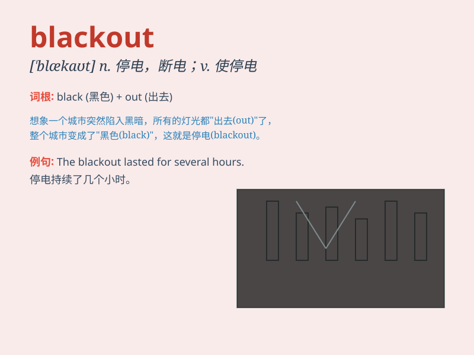

## blackout

**英音:** _[\'blækaʊt]_ **美音:** _[\'blækaʊt]_

**译义:** *n.灯火管制,(暂时的)眩晕,中断*

### 短语

+ **power blackout:** _停电_

+ **total blackout:** _完全停电；全面封锁_

+ **news blackout:** _新闻封锁_

+ **memory blackout:** _记忆丧失_

+ **blackout period:** _封锁期；禁售期_

### 例句

#### 例句1

> **The city experienced a blackout during the storm.**

**中文翻译:** 暴风雨期间，这座城市经历了一次停电。

**单词释义:** 停电；断电

#### 例句2

> **He had a blackout and couldn\'t remember what happened last
night.**

**中文翻译:** 他眼前一黑，不记得昨晚发生了什么。

**单词释义:** 昏厥；暂时失去意识

#### 例句3

> **The news report was blacked out for security reasons.**

**中文翻译:** 出于安全原因，该新闻报道被屏蔽。

**单词释义:** 封锁；遮蔽

### 背诵小故事

> One night, the city had a blackout. Everything was dark. People
couldn\'t see and were scared. But they found candles and waited for the
power to come back. \'Blackout\' means a total loss of electricity.

**一天晚上，城市停电了。一切都漆黑一片。人们看不见，很害怕。但他们找到了蜡烛，等待电力恢复。\'blackout\'意思是停电，灯火管制。**

### 图义

