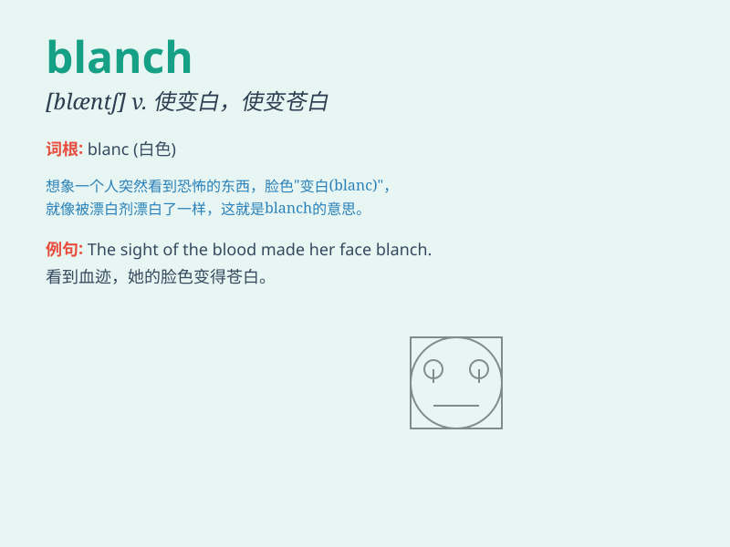

## blanch

**英音:** _[blɑːn(t)ʃ]_ **美音:** _[blæntʃ]_

**译义:** *v.漂白,使变白,遮断阳光 发白*

### 短语

+ **blanch at:** _因\...\...而脸色发白_

+ **blanch with fear:** _因恐惧而脸色发白_

+ **blanch vegetables:** _焯蔬菜_

+ **blanch almonds:** _焯杏仁_

+ **blanch suddenly:** _突然变白_

### 例句

#### 例句1

> **The sight of blood made her blanch.**

**中文翻译:** 看到血，她脸色煞白。

**单词释义:** 脸色变得苍白

#### 例句2

> **Blanch the vegetables in boiling water for a few minutes.**

**中文翻译:** 将蔬菜放入沸水中焯几分钟。

**单词释义:** 用沸水烫白（蔬菜）

#### 例句3

> **He blanched at the thought of having to speak in public.**

**中文翻译:** 一想到必须在公开场合讲话，他脸色就变白了。

**单词释义:** （因恐惧等）退缩

### 背诵小故事

> A brave knight named Blanch was always pale when facing the fierce
dragon. But as he grew stronger, he stopped blanching and became
fearless. Blanch here means to turn pale from fear or shock.

**一位名叫布兰奇的勇敢骑士，每次面对凶猛的巨龙总是脸色苍白。但随着他变得强大，他不再脸色发白，变得无所畏惧。这里
blanch 指因恐惧或震惊而脸色苍白。**

### 图义

