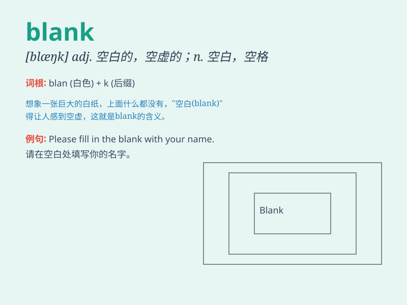

## blank

**英音:** _[blæŋk]_ **美音:** _[blæŋk]_

**译义:** *adj.空白的,空着的,失色的,没有表情的n.空白,\<美> 表格*

### 短语

+ **blank check:** _空白支票；自由处理权_

+ **blank space:** _空白区；空白空间_

+ **blank page:** _空白页_

+ **go blank:** _（头脑）变成空白_

+ **blank expression:** _茫然的表情_

### 例句

#### 例句1

> **Please fill in the blank spaces on the form.**

**中文翻译:** 请填写表格上的空白处。

**单词释义:** 空白处

#### 例句2

> **Her expression was blank when she heard the news.**

**中文翻译:** 当她听到这个消息时，表情一片空白。

**单词释义:** 茫然的

#### 例句3

> **I drew a blank when I tried to remember his name.**

**中文翻译:** 当我试图记住他的名字时，我一片空白。

**单词释义:** 空白；无结果

### 背诵小故事

> One day, Tom was given a blank sheet of paper and asked to draw his
dream house. He stared at the blank page, thinking hard. Finally, he
started to draw and filled the blank with his imagination.

**一天，汤姆得到一张空白的纸并被要求画出他梦想中的房子。他盯着这张空白的纸，努力思考。最后，他开始画，用想象填满了空白。**

### 图义

