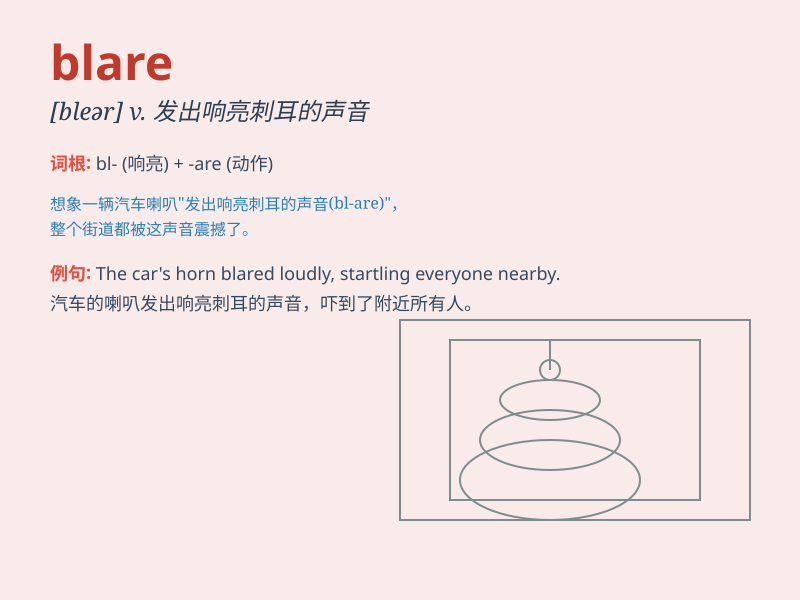

## blare

**英音:** _[bleə]_ **美音:** _[blɛr]_

**译义:** *n.号声v.奏鸣*

### 短语

+ **blare out:** _大声发出；大声播放_

+ **blare forth:** _突然响起；大声说出_

+ **blare of horns:** _喇叭的响亮声音_

+ **loud blare:** _响亮的吼声_

+ **continuous blare:** _持续的响亮声音_

### 例句

#### 例句1

> **The car horns blared in the traffic jam.**

**中文翻译:** 堵车时汽车喇叭鸣响。

**单词释义:** 发出响亮的声音

#### 例句2

> **The music blared from the speakers.**

**中文翻译:** 扬声器里传出音乐声。

**单词释义:** 大声播放

#### 例句3

> **The sirens blared as the fire engines rushed to the scene.**

**中文翻译:** 当消防车赶到现场时，警报响起。

**单词释义:** 响亮地鸣响

### 背诵小故事

> A fire truck was speeding along the street, its siren blaring loudly.
Everyone knew it was an emergency. The blare of the siren was so intense
that it made people cover their ears.

**一辆消防车沿着街道疾驰，警笛大声鸣响。每个人都知道有紧急情况。警笛的鸣响如此强烈，以至于人们都捂住了耳朵。**

### 图义

