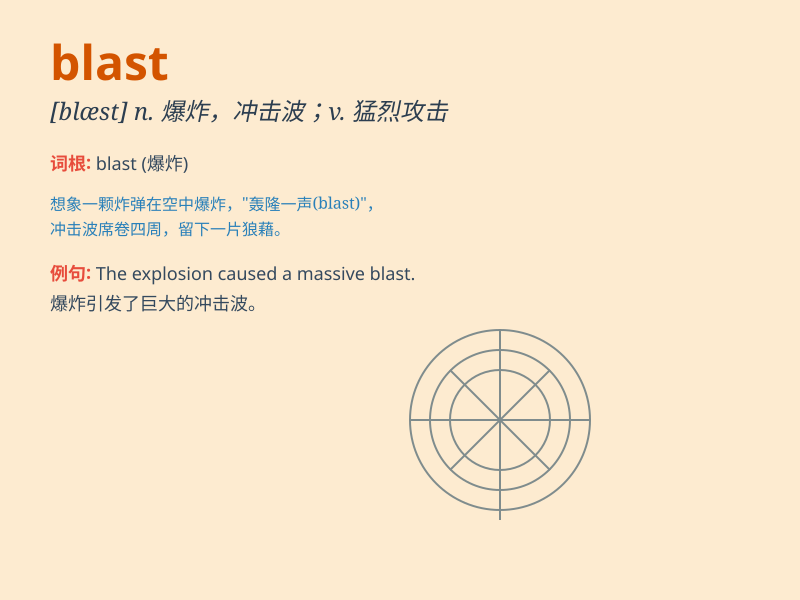

## blast

**英音:** _[blɑːst]_ **美音:** _[blæst]_

**译义:**
*n.一阵(风),一股(气流),爆炸,冲击波vt.爆炸,,毁灭,使枯萎,损害*

### 短语

+ **blast off:** _（火箭、航天器等）发射，升空_

+ **a blast of:** _一阵（风、声音等）_

+ **blast through:** _强行通过；冲破_

+ **full blast:** _全力地；全速地_

+ **blast away:** _炸毁；炸掉_

### 例句

#### 例句1

> **The bomb blast destroyed several buildings.**

**中文翻译:** 炸弹爆炸摧毁了几座建筑物。

**单词释义:** 爆炸

#### 例句2

> **The music was blasting from the speakers.**

**中文翻译:** 扬声器里传出音乐声。

**单词释义:** 大声播放

#### 例句3

> **He gave a blast on his trumpet.**

**中文翻译:** 他吹响了喇叭。

**单词释义:** 猛吹

### 背诵小故事

> A powerful monster was about to blast the city. The hero used a
special shield to stop the blast. Just in time, the city was saved. The
blast was so strong that it made a huge noise.

**一只强大的怪物正要炸毁城市。英雄用一面特殊的盾牌阻挡了爆炸。刚好及时，城市得救了。这次爆炸威力巨大，发出了巨大的声响。**

### 图义

