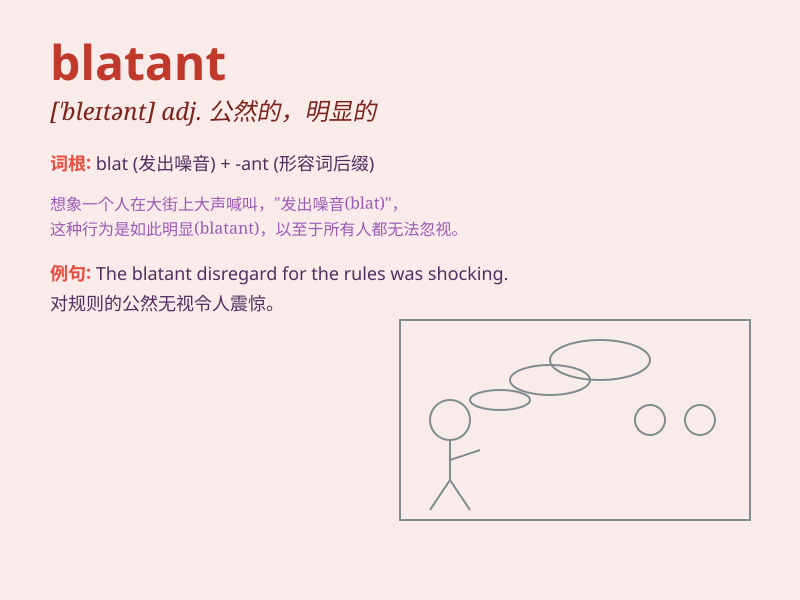

## blatant

**英音:** _[ˈbleɪtnt]_ **美音:** _[ˈbleɪtnt]_

**译义:** *adj.喧嚣的,俗丽的,吵闹的,炫耀的*

### 短语

+ **blatant lie:** _公然的谎言_

+ **blatant violation:** _公然的违反_

+ **blatant injustice:** _明目张胆的不公正_

+ **blatant mistake:** _明显的错误_

+ **blatant plagiarism:** _公然的抄袭_

### 例句

#### 例句1

> **His blatant disregard for the rules cost him his job.**

**中文翻译:** 他对规则的公然无视让他失去了工作。

**单词释义:** 公然的；明目张胆的

#### 例句2

> **The blatant lie was easily exposed.**

**中文翻译:** 这个弥天大谎很容易就被揭穿了。

**单词释义:** 明目张胆的；公然的

#### 例句3

> **She was shocked by his blatant disrespect.**

**中文翻译:** 她对他公然的不尊重感到震惊。

**单词释义:** 公然的；露骨的

### 背诵小故事

> A king had a servant who was always making blatant mistakes. One day,
the servant broke a precious vase loudly and openly. The king was very
angry and shouted, \'Your mistakes are so blatant!\'

**一位国王有个仆人总是犯明显的错误。有一天，仆人公然大声地打碎了一个珍贵的花瓶。国王非常生气并喊道：'你的错误太明显了！'**

### 图义

