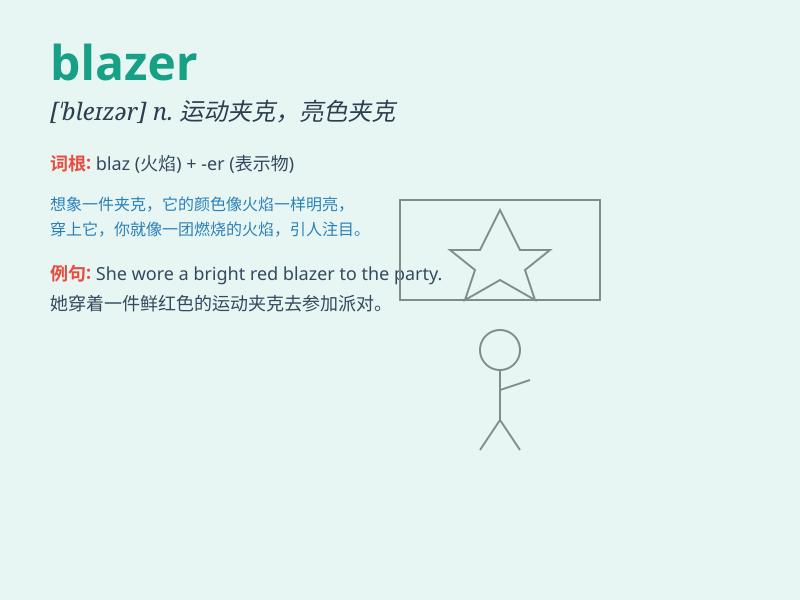

## blazer

**英音:** _[\'bleɪzə]_ **美音:** _[\'blezɚ]_

**译义:** *n.颜色鲜明的运动夹克,宣布者*

### 短语

+ **navy blazer:** _海军蓝西装上衣_

+ **double-breasted blazer:** _双排扣西装上衣_

+ **single-breasted blazer:** _单排扣西装上衣_

+ **wool blazer:** _羊毛西装上衣_

+ **cotton blazer:** _棉质西装上衣_

### 例句

#### 例句1

> **She wore a red blazer to the business meeting.**

**中文翻译:** 她穿着一件红色西装外套参加商务会议。

**单词释义:** 运动夹克

#### 例句2

> **The school uniform includes a blue blazer.**

**中文翻译:** 校服包括一件蓝色西装外套。

**单词释义:** 运动夹克

#### 例句3

> **He looked smart in his black blazer and jeans.**

**中文翻译:** 他穿着黑色西装外套和牛仔裤，看上去很帅气。

**单词释义:** 运动夹克

### 背诵小故事

> One day, Tom was going to a party. He wore a special jacket called a
blazer. It was bright and made him stand out. Everyone praised his
stylish blazer. Now, whenever Tom sees a blazer, he remembers that fun
party.

**有一天，汤姆要去参加一个聚会。他穿了一件特别的夹克，叫做西装外套。它很亮丽，让他脱颖而出。每个人都称赞他时髦的西装外套。现在，每当汤姆看到西装外套，他就会想起那个有趣的聚会。**

### 图义

