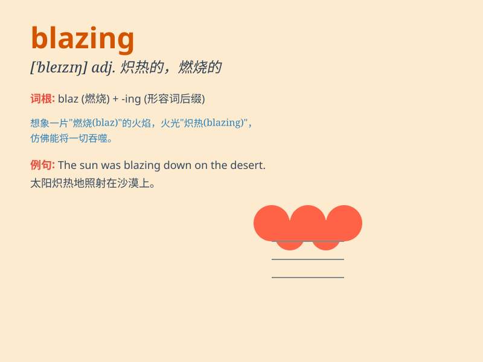

## blazing

**英音:** _[\'bleɪzɪŋ]_ **美音:** _[\'blezɪŋ]_

**译义:** *adj.炽烧的,闪耀的,强烈的*

### 短语

+ **blazing sun:** _炽热的太阳_

+ **blazing speed:** _极快的速度_

+ **blazing fire:** _熊熊大火_

+ **blazing trail:** _开辟道路_

+ **blazing argument:** _激烈的争论_

### 例句

#### 例句1

> **The sun was blazing down on the beach.**

**中文翻译:** 阳光照耀在海滩上。

**单词释义:** 炽热地

#### 例句2

> **The fire was blazing in the fireplace.**

**中文翻译:** 壁炉里的火正熊熊燃烧。

**单词释义:** 熊熊地

#### 例句3

> **She has a blazing temper.**

**中文翻译:** 她脾气暴躁。

**单词释义:** 非常强烈的

### 背诵小故事

> A brave knight was riding through a forest on a blazing hot day. The
sun was shining so brightly that it felt like the whole world was on
fire. \'Blazing\' means very hot and bright, just like that sun.

**一位勇敢的骑士在一个酷热的日子里骑马穿过森林。太阳明亮地照耀着，感觉整个世界都在燃烧。'blazing'意思是非常炎热和明亮，就像那太阳一样。**

### 图义

