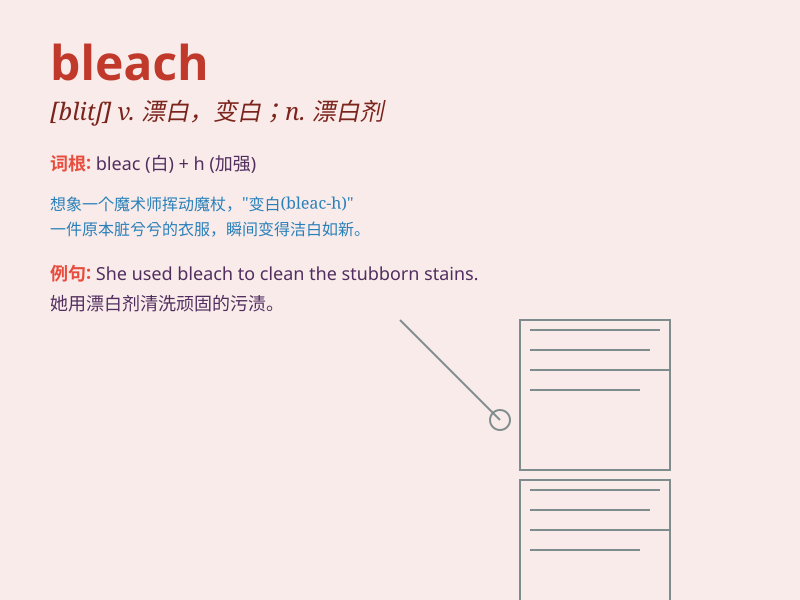

## bleach

**英音:** _[bliːtʃ]_ **美音:** _[blitʃ]_

**译义:** *v.漂白,变白*

### 短语

+ **bleach out:** _（使）褪色；（使）变白_

+ **bleach blonde:** _（头发）漂成的金黄色_

+ **bleach water:** _漂白水_

+ **bleach the clothes:** _漂白衣服_

+ **bleach the stains:** _漂白污渍_

### 例句

#### 例句1

> **She decided to bleach her hair blonde.**

**中文翻译:** 她决定把头发漂白成金色。

**单词释义:** 漂白，使褪色

#### 例句2

> **The sun had bleached the curtains.**

**中文翻译:** 阳光把窗帘晒白了。

**单词释义:** 使变白，使褪色

#### 例句3

> **You need to bleach the stains on the shirt.**

**中文翻译:** 你需要漂白衬衫上的污渍。

**单词释义:** 漂白，除去（颜色、污渍等）

### 背诵小故事

> A young artist was painting a beautiful landscape. But the colors
were too dark. So, he used bleach to make them brighter and more vivid.
Finally, his painting became a masterpiece.

**一位年轻的艺术家正在画一幅美丽的风景画。但颜色太暗了。于是，他用漂白剂让颜色更明亮、更生动。最终，他的画成了杰作。**

### 图义

