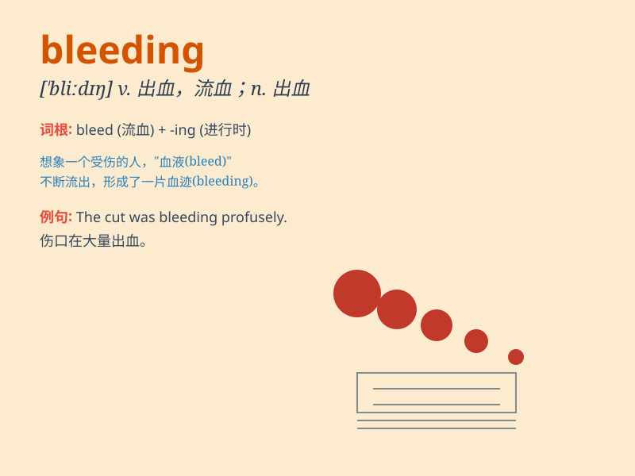

## bleeding

**英音:** _[\'bliːdɪŋ]_ **美音:** _[\'blidɪŋ]_

**译义:** *n.出血,流血*

### 短语

+ **bleeding heart:** _心肠软的人；对他人的不幸过于同情者_

+ **bleeding edge:** _前沿；尖端_

+ **stop the bleeding:** _止血；阻止损失_

+ **internal bleeding:** _内出血_

+ **postpartum bleeding:** _产后出血_

### 例句

#### 例句1

> **The bleeding wound needed immediate attention.**

**中文翻译:** 流血的伤口需要立即治疗。

**单词释义:** 流血的

#### 例句2

> **Stop the bleeding as soon as possible.**

**中文翻译:** 尽快止血。

**单词释义:** 流血

#### 例句3

> **The doctor was trying to control the patient\'s bleeding.**

**中文翻译:** 医生正在努力控制病人的出血。

**单词释义:** 出血

### 背诵小故事

> One day, Tom had a bad fall and his knee was bleeding. He was in
great pain. But with the help of a kind doctor, the bleeding finally
stopped and he recovered.

**一天，汤姆摔得很严重，他的膝盖在流血。他非常痛苦。但在一位好心医生的帮助下，流血终于止住了，他也康复了。**

### 图义

