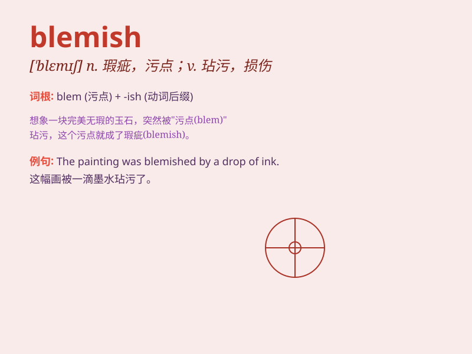

## blemish

**英音:** _[\'blemɪʃ]_ **美音:** _[\'blɛmɪʃ]_

**译义:** *n.污点,缺点,瑕疵vt.弄脏,玷污,损害*

### 短语

+ **skin blemish:** _皮肤瑕疵_

+ **blemish free:** _无瑕疵的_

+ **blemish remover:** _瑕疵去除剂_

+ **minor blemish:** _小瑕疵_

+ **surface blemish:** _表面瑕疵_

### 例句

#### 例句1

> **The scratch on the car was a minor blemish.**

**中文翻译:** 车上的划痕只是一个小瑕疵。

**单词释义:** 瑕疵；污点

#### 例句2

> **Her flawless complexion had no blemish.**

**中文翻译:** 她的肤色完美无瑕，没有任何瑕疵。

**单词释义:** 瑕疵；缺陷

#### 例句3

> **The scandal was a blemish on his reputation.**

**中文翻译:** 这起丑闻损害了他的声誉。

**单词释义:** 污点；损害

### 背诵小故事

> A beautiful princess had a blemish on her face. It was a small mark,
but it made her very sad. However, a kind fairy used magic to remove the
blemish and made her happy again. Remember, blemish means a mark or
flaw.

**一位美丽的公主脸上有个瑕疵。这是个小斑点，但让她很伤心。然而，一位善良的仙女用魔法去掉了这个瑕疵，让她再次开心起来。记住，blemish
意思是污点、瑕疵。**

### 图义

