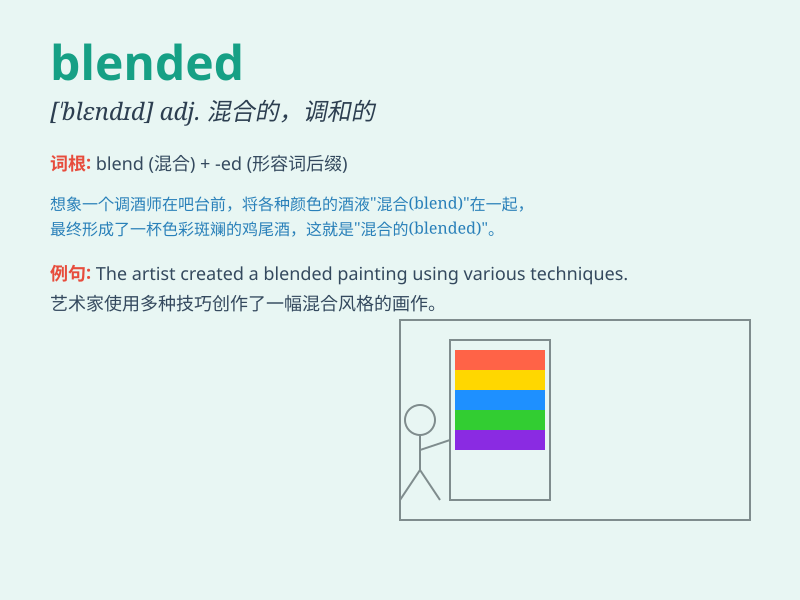

## blended

**英音:** _[ˈblendɪd]_ **美音:** _[ˈblendɪd]_

**译义:** *adj. 混合的；掺和的；（由不同成分）混成的；融合的；v.
（使）混合，掺和，融合( blend的过去式和过去分词 )*

### 短语

+ **blended learning:** _混合式学习_

+ **blended family:** _混合家庭_

+ **blended whisky:** _混合威士忌_

+ **blended fabric:** _混纺织物_

+ **blended oil:** _混合油_

### 例句

#### 例句1

> **The coffee is a blended mixture of different beans.**

**中文翻译:** 这咖啡是由不同种类的咖啡豆混合而成的。

**单词释义:** 混合的

#### 例句2

> **They have a blended family with children from both previous
marriages.**

**中文翻译:** 他们有一个由双方前一段婚姻中的孩子组成的混合家庭。

**单词释义:** 混合的；融合的

#### 例句3

> **The smoothie is made from blended fruits.**

**中文翻译:** 这杯冰沙是由混合的水果制成的。

**单词释义:** 混合的

### 背诵小故事

> A group of friends went on a picnic. They brought blended juices. The
juices were a mix of different fruits. So, \'blended\' means mixed
together. They enjoyed the blended drinks in the beautiful park.

**一群朋友去野餐。他们带来了混合果汁。这些果汁是由不同水果混合而成的。所以，\'blended\'意思是混合在一起。他们在美丽的公园里享受着混合饮料。**

### 图义

