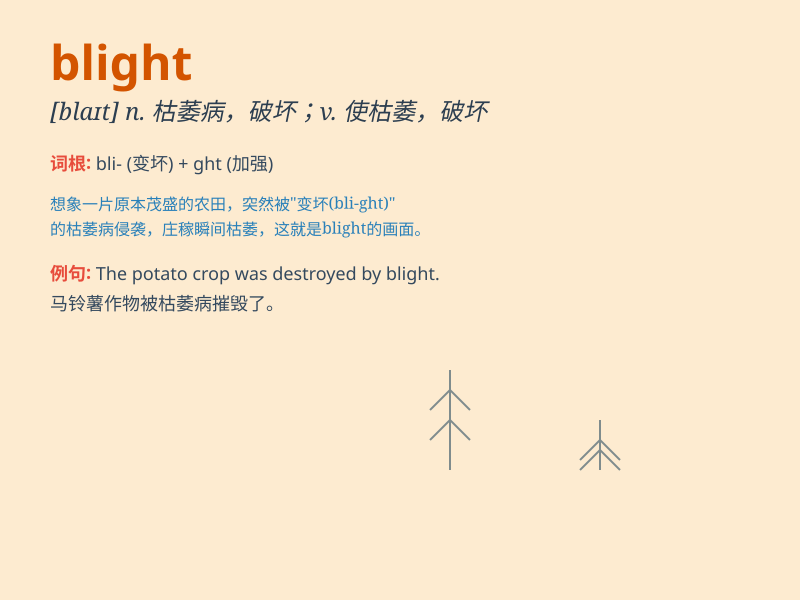

## blight

**英音:** _[blaɪt]_ **美音:** _[blaɪt]_

**译义:** *n.枯萎病,不良影响,打击vt.破坏,使枯萎*

### 短语

+ **urban blight:** _城市衰落；城市破败_

+ **potato blight:** _马铃薯疫病_

+ **blight control:** _枯萎病防治_

+ **crop blight:** _作物枯萎病_

+ **blight damage:** _枯萎损害_

### 例句

#### 例句1

> **The disease blighted the crops and caused a huge loss to the
farmers.**

**中文翻译:** 这种病害使庄稼枯萎，给农民造成了巨大损失。

**单词释义:** 损害；使枯萎

#### 例句2

> **The urban blight in this area makes it less attractive for
investment.**

**中文翻译:** 该地区的城市衰败使其投资吸引力下降。

**单词释义:** 破坏；使衰败

#### 例句3

> **His criminal record blighted his chances of getting a good
job.**

**中文翻译:** 他的犯罪记录使他失去了找到好工作的机会。

**单词释义:** 损害；玷污

### 背诵小故事

> A farmer\'s crops were growing well until a mysterious blight came.
It made the leaves turn brown and the plants wither. The farmer was very
sad as all his hard work seemed ruined. But he didn\'t give up and tried
to find a way to fight the blight.

**一位农民的庄稼本来长得很好，直到一种神秘的枯萎病袭来。它使叶子变成褐色，植物枯萎。农民非常伤心，因为他所有的辛勤劳动似乎都毁了。但他没有放弃，试图找到对抗枯萎病的方法。**

### 图义

