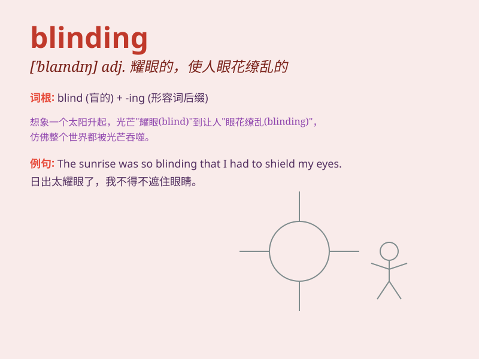

## blinding

**英音:** _[ˈblaɪndɪŋ]_ **美音:** _[ˈblaɪndɪŋ]_

**译义:** *adj.使眩目的,使失去判断力的n.碎石子*

### 短语

+ **blinding headache:** _剧烈的头痛_

+ **blinding light:** _耀眼的光_

+ **blinding snow:** _茫茫大雪_

+ **blinding speed:** _极快的速度_

+ **a blinding flash:** _一道耀眼的闪光_

### 例句

#### 例句1

> **The sun was blinding as I stepped out of the car.**

**中文翻译:** 当我走出车时，阳光刺眼。

**单词释义:** 耀眼的；使人眩目的

#### 例句2

> **She was in a blinding rage when she found out the truth.**

**中文翻译:** 当她得知真相后，怒不可遏。

**单词释义:** 极其愤怒的

#### 例句3

> **The evidence against him was blindingly obvious.**

**中文翻译:** 对他不利的证据是显而易见的。

**单词释义:** 极其明显的

### 背诵小故事

> A driver was on a long journey. Suddenly, a blinding light from the
opposite direction made him unable to see clearly. But luckily, he
managed to stop the car safely. The \'blinding\' light was so intense!

**一位司机正在长途旅行。突然，对面一道刺眼的光让他看不清。但幸运的是，他成功安全地停了车。这道'刺眼的'光太强烈了！**

### 图义

