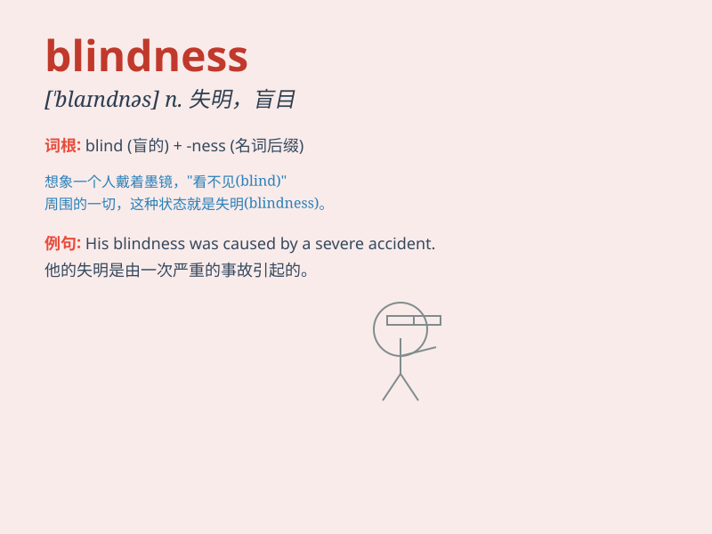

## blindness

**英音:** _[\'blaɪdnɪs]_ **美音:** _[\'blaɪndnɪs]_

**译义:** *n.失明,文盲,愚昧,轻举妄动,盲目性*

### 短语

+ **color blindness:** _色盲_

+ **night blindness:** _夜盲症_

+ **legal blindness:** _法定盲_

+ **cortical blindness:** _皮质盲_

+ **partial blindness:** _部分失明_

### 例句

#### 例句1

> **Blindness can make daily life very challenging.**

**中文翻译:** 失明会使日常生活变得非常具有挑战性。

**单词释义:** 失明；盲目

#### 例句2

> **The doctor is researching the causes of blindness.**

**中文翻译:** 医生正在研究失明的原因。

**单词释义:** 失明

#### 例句3

> **We should raise awareness of blindness and support those
affected.**

**中文翻译:** 我们应该提高对失明的认识并支持那些受影响的人。

**单词释义:** 失明

### 背诵小故事

> Once upon a time, in a dark cave, a brave adventurer was lost. The
total darkness caused him blindness. He had to rely on his other senses
to find a way out. Finally, he escaped and understood the horror of
blindness.

**从前，在一个黑暗的洞穴里，一位勇敢的探险家迷路了。完全的黑暗导致他失明。他不得不依靠其他感官寻找出路。最后，他逃脱了，并理解了失明的可怕。**

### 图义

