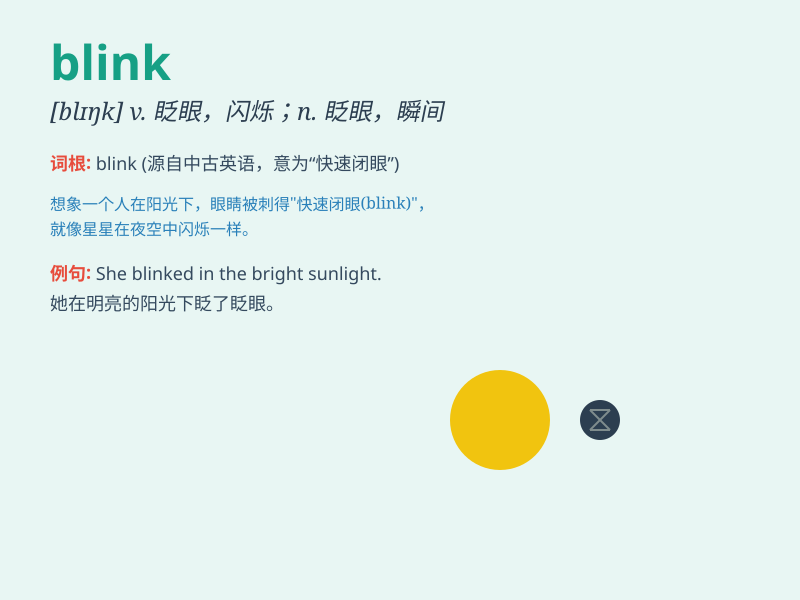

## blink

**英音:** _[blɪŋk]_ **美音:** _[blɪŋk]_

**译义:** *v.眨眼,闪亮,无视*

### 短语

+ **blink one\'s eyes:** _眨眼_

+ **in the blink of an eye:** _眨眼之间；瞬间_

+ **blink at:** _对\...\...眨眼；惊愕地看_

+ **on the blink:** _（机器等）坏了，出故障_

+ **blink away:** _眨眼消除（泪水等）_

### 例句

#### 例句1

> **She blinked her eyes rapidly when the light was too bright.**

**中文翻译:** 当光线太亮时，她快速地眨了眨眼睛。

**单词释义:** 眨（眼睛）

#### 例句2

> **The stars seemed to blink in the sky.**

**中文翻译:** 天空中的星星似乎在闪烁。

**单词释义:** 闪烁

#### 例句3

> **Don\'t blink or you\'ll miss the magic trick.**

**中文翻译:** 不要眨眼，否则你会错过魔术。

**单词释义:** 眨眼

### 背诵小故事

> One night, when I was walking in the dark alley, a black cat suddenly
appeared and blinked at me. Its shining eyes blinked so fast that it
scared me. Later I knew \'blink\' means to close and open your eyes
quickly.

**一天晚上，当我走在黑暗的小巷时，一只黑猫突然出现并朝我眨眼。它闪亮的眼睛快速眨动，把我吓到了。后来我知道了\'blink\'是快速地闭合和睁开眼睛的意思。**

### 图义

