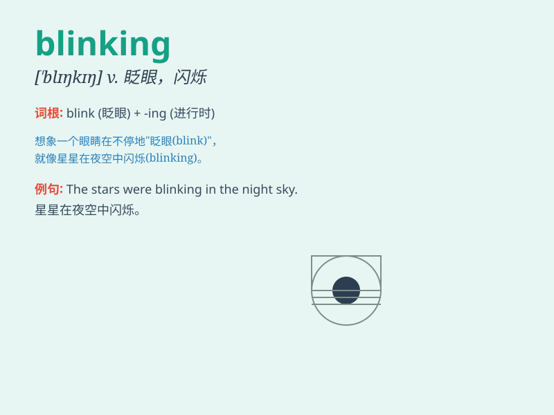

## blinking

**英音:** _[ˈblɪŋkɪŋ]_ **美音:** _[ˈblɪŋkɪŋ]_

**译义:** *adj.闪光的,一眨眼的*

### 短语

+ **blinking light:** _闪烁的灯光_

+ **keep blinking:** _不停地眨眼_

+ **blinking cursor:** _闪烁的光标_

+ **blinking sign:** _闪烁的标志_

+ **blinking stars:** _闪烁的星星_

### 例句

#### 例句1

> **The blinking lights caught my attention.**

**中文翻译:** 闪烁的灯光引起了我的注意。

**单词释义:** 闪烁的

#### 例句2

> **Stop blinking your eyes so much, it\'s a bad habit.**

**中文翻译:** 别再频繁地眨眼睛了，这是一个坏习惯。

**单词释义:** 眨（眼睛）

#### 例句3

> **The blinking cursor on the screen was annoying.**

**中文翻译:** 屏幕上闪烁的光标很烦人。

**单词释义:** 闪烁的

### 背诵小故事

> A little girl was lost in a blinking forest. The lights of fireflies
were blinking everywhere, confusing her. But she finally found her way
out by following a blinking star.

**一个小女孩在一个闪烁的森林里迷路了。萤火虫的光到处闪烁，让她感到困惑。但她最终通过跟随一颗闪烁的星星找到了出路。**

### 图义

