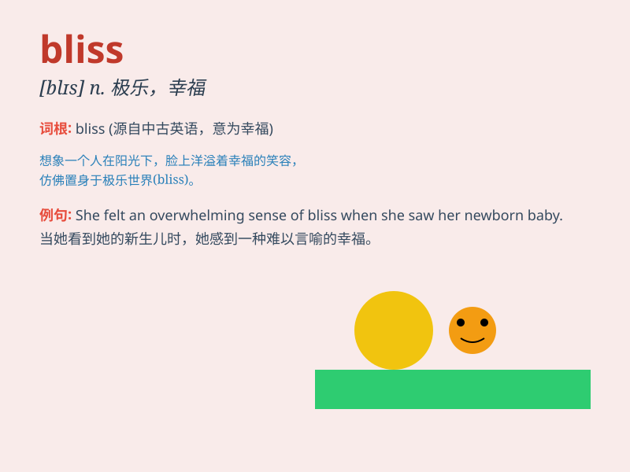

## bliss

**英音:** _[blɪs]_ **美音:** _[blɪs]_

**译义:** *n.福佑,天赐的福*

### 短语

+ **bliss out:** _进入极度幸福或放松的状态_

+ **wedded bliss:** _婚姻的幸福_

+ **bliss point:**
_极乐点（指产品或体验在某个特定方面达到最令人满足的程度）_

+ **domestic bliss:** _家庭的幸福_

+ **blissful ignorance:**
_幸福的无知（指不知道某些可能令人烦恼的事情而感到快乐）_

### 例句

#### 例句1

> **Falling in love was pure bliss for her.**

**中文翻译:** 坠入爱河对她来说是纯粹的幸福。

**单词释义:** 幸福；极乐

#### 例句2

> **They spent their honeymoon in a state of bliss.**

**中文翻译:** 他们在幸福的状态中度过了蜜月。

**单词释义:** 极度幸福

#### 例句3

> **Winning the lottery brought her a moment of bliss.**

**中文翻译:** 中了彩票给她带来了短暂的幸福。

**单词释义:** 幸福；快乐

### 背诵小故事

> A young artist was constantly seeking inspiration. One day, while
painting in a peaceful garden, he suddenly felt a sense of pure joy and
contentment. That moment was his bliss. It was like finding a hidden
treasure in the midst of chaos.

**一位年轻的艺术家一直在寻找灵感。有一天，当他在一个宁静的花园里作画时，突然感到一种纯粹的喜悦和满足。那一刻就是他的极乐。就像在混乱中找到了隐藏的宝藏。**

### 图义

