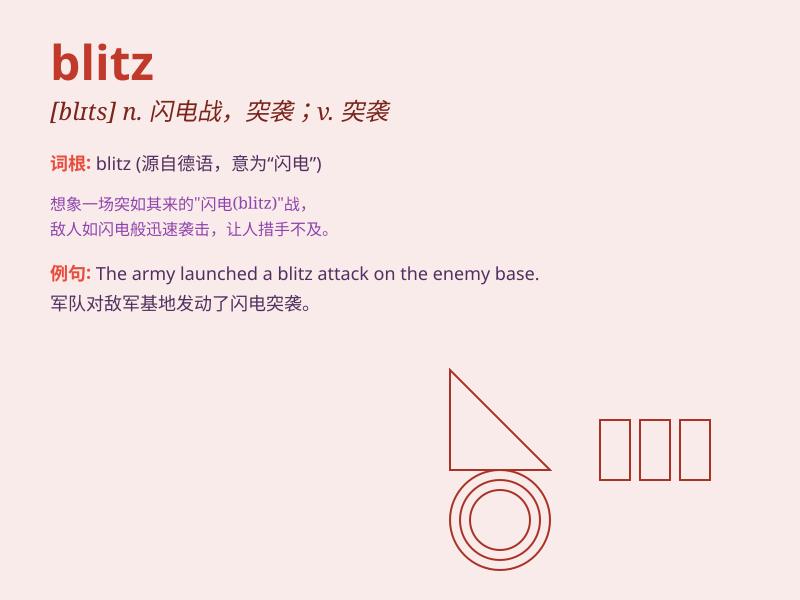

## blitz

**英音:** _[blɪts]_ **美音:** _[blɪts]_

**译义:** *n.[军]闪电战vt.以闪电战攻击*

### 短语

+ **blitz attack:** _闪电式攻击_

+ **blitz campaign:** _闪电式运动_

+ **blitz spirit:** _闪电战精神_

+ **media blitz:** _媒体闪电战_

+ **advertising blitz:** _广告闪电战_

### 例句

#### 例句1

> **The army launched a blitz on the enemy\'s position.**

**中文翻译:** 军队对敌人的阵地发动了闪电式攻击。

**单词释义:** 闪电式的攻击

#### 例句2

> **The store had a blitz sale over the weekend.**

**中文翻译:** 这家商店在周末进行了大促销。

**单词释义:** 大规模的、集中的活动（如促销）

#### 例句3

> **The team went on a blitz to finish the project before the
deadline.**

**中文翻译:** 团队为了在截止日期前完成项目而进行了突击。

**单词释义:** 突击

### 背诵小故事

> 二战时，敌军突然发动了一场名为 blitz
的闪电袭击。城市瞬间陷入混乱，人们四处奔逃。这种迅猛、突然的攻击就像闪电一样，让人猝不及防。

**在二战时，敌军突然发动的被称为'闪电战'的迅猛、突然的袭击。城市瞬间陷入混乱，人们四处奔逃。这种攻击就像闪电一样，让人猝不及防。**

### 图义

