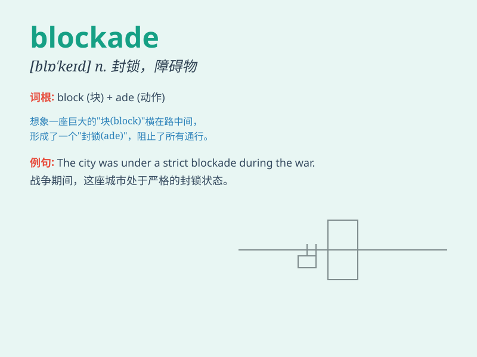

## blockade

**英音:** _[blɒ\'keɪd]_ **美音:** _[blɑ\'ked]_

**译义:** *n.阻塞vt.封锁*

### 短语

+ **naval blockade:** _海上封锁_

+ **economic blockade:** _经济封锁_

+ **lift the blockade:** _解除封锁_

+ **impose a blockade:** _实施封锁_

+ **break the blockade:** _突破封锁_

### 例句

#### 例句1

> **The country imposed a blockade on the enemy\'s ports.**

**中文翻译:** 这个国家对敌人的港口实施了封锁。

**单词释义:** 封锁（动词）

#### 例句2

> **The blockade caused severe shortages of food and medicine.**

**中文翻译:** 这次封锁导致了食品和药品的严重短缺。

**单词释义:** 封锁（名词）

#### 例句3

> **They managed to break through the blockade and escape.**

**中文翻译:** 他们设法突破了封锁并逃走了。

**单词释义:** 封锁（名词）

### 背诵小故事

> A group of brave soldiers decided to blockade the enemy\'s supply
route. They built barriers and stood guard day and night to stop any
supplies from reaching the enemy. This blockade was crucial for their
victory.

**一群勇敢的士兵决定封锁敌人的补给路线。他们筑起障碍物，日夜站岗，阻止任何补给到达敌人那里。这次封锁对他们的胜利至关重要。**

### 图义

