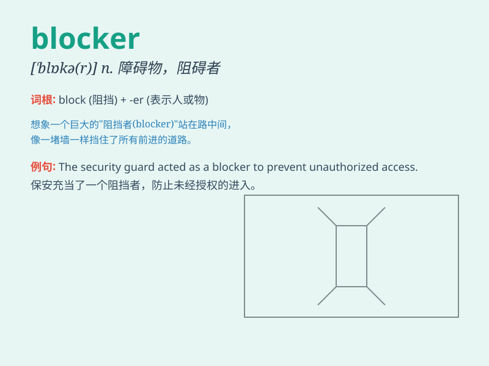

## blocker

**英音:** _[ˈblɒkə(r)]_ **美音:** _[ˈblɑːkər]_

**译义:** *n. 阻碍物；障碍物；阻挡者；阻挡器*

### 短语

+ **blood blocker:** _血液阻滞剂_

+ **pain blocker:** _止痛剂_

+ **receptor blocker:** _受体阻滞剂_

+ **calcium blocker:** _钙通道阻滞剂_

+ **beta blocker:** _β受体阻滞剂_

### 例句

#### 例句1

> **The new medicine is a potential blocker of cancer cell
growth.**

**中文翻译:** 这种新药物是一种潜在的癌细胞生长阻滞剂。

**单词释义:** 阻滞剂；阻碍物

#### 例句2

> **He\'s a blocker on our team, responsible for defending against
the opponent\'s attacks.**

**中文翻译:** 他是我们队里的阻挡球员，负责抵御对手的进攻。

**单词释义:** 阻挡者；防守队员

#### 例句3

> **The traffic jam was caused by a road blocker.**

**中文翻译:** 交通堵塞是由路障引起的。

**单词释义:** 障碍物；路障

### 背诵小故事

> A brave knight was on a quest. But a huge blocker, a magic stone
wall, blocked his way. He had to find a way to overcome it to continue
his adventure.

**一位勇敢的骑士正在进行探索。但是一个巨大的阻碍物，一堵魔法石墙，挡住了他的路。他必须想办法克服它才能继续他的冒险。**

### 图义

