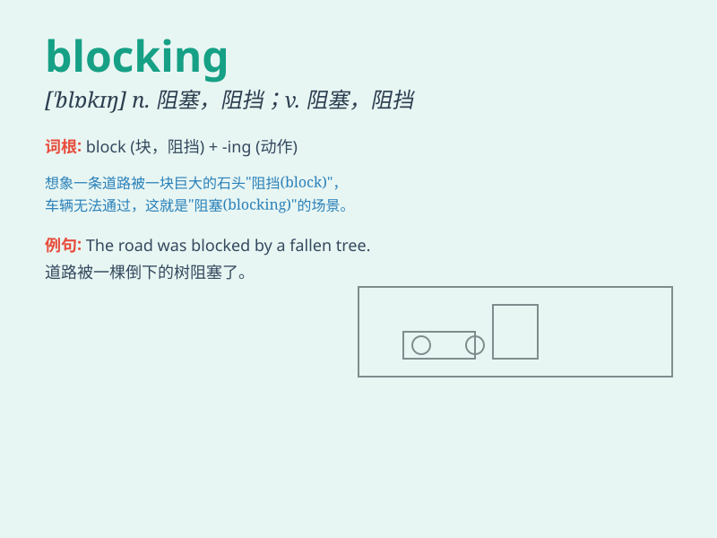

## blocking

**英音:** _[blɒkɪŋ]_ **美音:** _[\'blɑkɪŋ]_

**译义:** *
舞台场面设计,舞台调度;舞台调度,舞台场面调度设计;模块化*

### 短语

+ **traffic blocking:** _交通堵塞_

+ **signal blocking:** _信号阻塞_

+ **view blocking:** _视线阻挡_

+ **emotion blocking:** _情感压抑_

+ **energy blocking:** _能量阻塞_

### 例句

#### 例句1

> **The blocking of the road caused a huge traffic jam.**

**中文翻译:** 道路的堵塞造成了严重的交通堵塞。

**单词释义:** 堵塞；阻塞

#### 例句2

> **She was accused of blocking the investigation.**

**中文翻译:** 她被指控阻碍调查。

**单词释义:** 阻碍；妨碍

#### 例句3

> **The goalkeeper made a brilliant blocking save.**

**中文翻译:** 守门员做出了一次精彩的封堵扑救。

**单词释义:** 封堵；挡住

### 背诵小故事

> A thief was running away, but the brave police formed a blocking line
to stop him. The crowd watched as the thief had no way out. \'Blocking\'
means creating an obstacle or hindrance.

**一个小偷正在逃跑，但勇敢的警察组成了一道阻拦线来阻止他。人群看着小偷无路可逃。\'blocking\'意思是形成阻碍或障碍。**

### 图义

