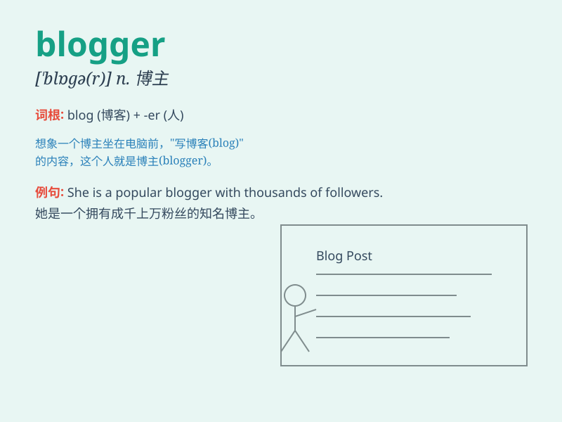

## blogger

**英音:** _[ˈblɒɡə(r)]_ **美音:** _[ˈblɑːɡər]_

**译义:** *名词：博客作者；写博客的人*

### 短语

+ **professional blogger:** _专业博客作者_

+ **famous blogger:** _著名博主_

+ **travel blogger:** _旅行博主_

+ **food blogger:** _美食博主_

+ **fashion blogger:** _时尚博主_

### 例句

#### 例句1

> **The blogger shared her travel experiences on her website.**

**中文翻译:** 这位博主在她的网站上分享了她的旅行经历。

**单词释义:** 写博客的人；博主

#### 例句2

> **He became a famous blogger overnight with his unique
insights.**

**中文翻译:** 他凭借独特的见解一夜之间成为了著名的博主。

**单词释义:** 写博客的人；博主

#### 例句3

> **The blogger\'s posts always attract a large number of
readers.**

**中文翻译:** 这位博主的帖子总是能吸引大量读者。

**单词释义:** 写博客的人；博主

### 背诵小故事

> One day, Tom decided to become a blogger. He spent hours writing
about his adventures and sharing his thoughts. His blog became popular,
and people loved his unique stories. Now, Tom is a well-known blogger.

**一天，汤姆决定成为一名博主。他花数小时撰写自己的冒险经历并分享想法。他的博客变得受欢迎，人们喜欢他独特的故事。现在，汤姆是一位知名的博主。**

### 图义

