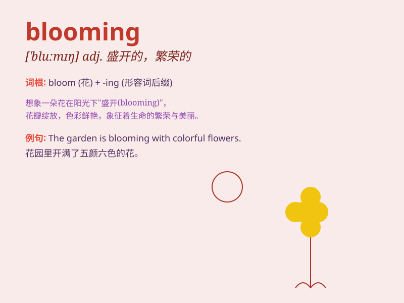

## blooming

**英音:** _[\'bluːmɪŋ]_ **美音:** _[\'blumɪŋ]_

**译义:** *adj.盛开的*

### 短语

+ **in full blooming:** _盛开；全盛_

+ **blooming period:** _开花期_

+ **a blooming garden:** _繁花似锦的花园_

+ **blooming beauty:** _绽放的美丽_

+ **blooming season:** _开花季节_

### 例句

#### 例句1

> **The roses are blooming beautifully in the garden.**

**中文翻译:** 花园里的玫瑰花开得很漂亮。

**单词释义:** 开花；绽放

#### 例句2

> **You blooming idiot! How could you make such a mistake?**

**中文翻译:** 你这个花花白痴！你怎么会犯这样的错误呢？

**单词释义:** 用以加强语气，表示愤怒或生气

#### 例句3

> **The blooming economy attracts many foreign investors.**

**中文翻译:** 蓬勃发展的经济吸引了许多外国投资者。

**单词释义:** 繁荣的；兴旺的

### 背诵小故事

> A blooming flower in the garden attracted a little bee. The flower
was so beautiful and full of vitality. \'Blooming\' means growing and
flourishing beautifully, just like this flower.

**花园里一朵盛开的花吸引了一只小蜜蜂。这朵花如此美丽，充满生机。\'blooming\'意思是美丽地生长和繁荣，就像这朵花一样。**

### 图义

