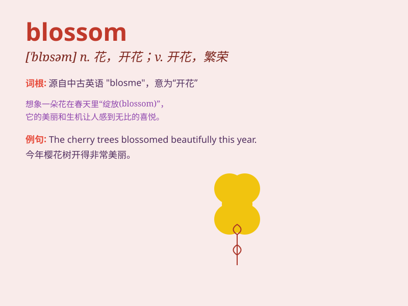

## blossom

**英音:** _[\'blɒs(ə)m]_ **美音:** _[\'blɑsəm]_

**译义:** *n.花(尤指结果实者),花开的状态,兴旺期vi.开花,兴旺,发展*

### 短语

+ **come into blossom:** _开花_

+ **in full blossom:** _盛开；花满枝头_

+ **blossom out:** _发展；成熟_

+ **cherry blossom:** _樱花_

+ **apple blossom:** _苹果花_

### 例句

#### 例句1

> **The cherry trees are in full blossom.**

**中文翻译:** 这些樱桃树正开满了花。

**单词释义:** 开花

#### 例句2

> **She has blossomed into a beautiful young woman.**

**中文翻译:** 她已出落成一个美丽的年轻女子。

**单词释义:** 发展；成长

#### 例句3

> **The friendship blossomed into love.**

**中文翻译:** 友谊发展成了爱情。

**单词释义:** 发展；变得更加美好

### 背诵小故事

> In the spring, a little girl named Lily walked in the garden. She saw
a tree full of beautiful flowers. The flowers were blossoming, and it
was such a wonderful sight. Lily was very happy and she knew that
blossom means flowers opening.

**在春天，一个叫莉莉的小女孩在花园里散步。她看到一棵满是漂亮花朵的树。花朵正在绽放，这是如此美妙的景象。莉莉非常高兴，她知道了blossom意思是开花。**

### 图义

