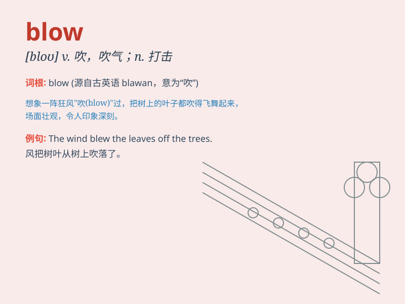

## blow

**英音:** _[bləʊ]_ **美音:** _[blo]_

**译义:** *n.殴打,突然的打击v.风吹,吹气于,叫,喘气*

### 短语

+ **blow up:** _爆炸；发脾气；放大_

+ **blow out:** _吹灭；爆裂_

+ **blow over:** _平息；消散；过去_

+ **blow away:** _吹走；驱散；留下深刻印象_

+ **give sb a blow:** _给某人一击_

### 例句

#### 例句1

> **The wind is blowing hard.**

**中文翻译:** 风刮得很猛。

**单词释义:** 吹；刮

#### 例句2

> **She blew out the candles on the cake.**

**中文翻译:** 她吹灭了蛋糕上的蜡烛。

**单词释义:** 吹灭

#### 例句3

> **The accident blew his mind.**

**中文翻译:** 这次事故使他心烦意乱。

**单词释义:** 使心烦意乱

### 背诵小故事

> A strong wind began to blow. It blew the papers off the desk and made
the tree branches shake. The wind blew so hard that it even blew a hat
away. Poor people had to hold onto their things tightly.

**一阵强风开始刮起来。它把桌上的纸吹掉了，还让树枝摇晃。风刮得如此猛烈，甚至把一顶帽子吹走了。可怜的人们不得不紧紧抓住他们的东西。**

### 图义

