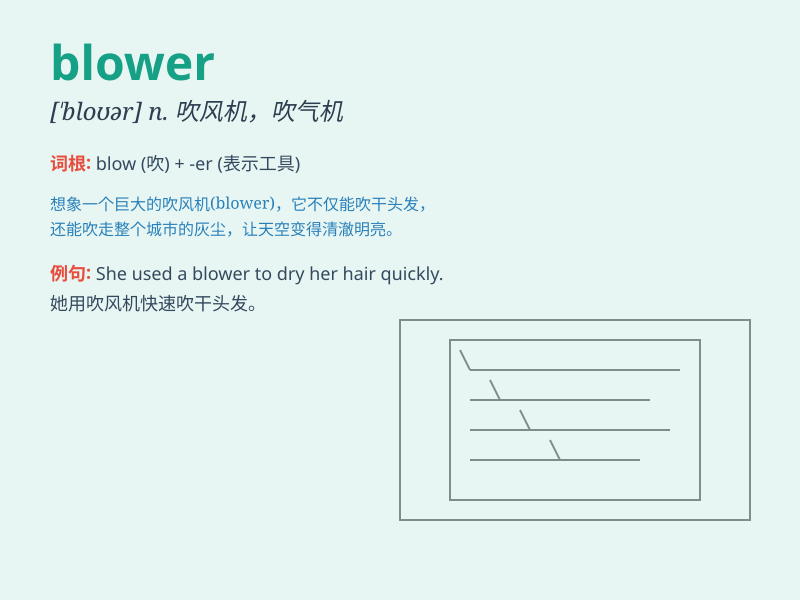

## blower

**英音:** _[\'bləʊə]_ **美音:** _[\'bloɚ]_

**译义:** *n.吹制工,送风机,吹风机,\<俚>爱吹牛的人*

### 短语

+ **air blower:** _鼓风机；吹风机_

+ **leaf blower:** _吹叶机_

+ **centrifugal blower:** _离心式鼓风机_

+ **positive displacement blower:** _容积式鼓风机_

+ **roots blower:** _罗茨鼓风机_

### 例句

#### 例句1

> **The blower is making a lot of noise.**

**中文翻译:** 吹风机正在制造很多噪音。

**单词释义:** 吹风机

#### 例句2

> **The blower in the factory helps to remove the dust.**

**中文翻译:** 工厂里的鼓风机有助于清除灰尘。

**单词释义:** 鼓风机

#### 例句3

> **The strong wind was like a blower, blowing away the leaves.**

**中文翻译:** 这股强风就像一个吹风机，吹走了树叶。

**单词释义:** 吹风机；风源

### 背诵小故事

> One day, when I was walking in the park, a strong wind suddenly blew.
I saw a blower machine working hard to clear the fallen leaves. It made
a loud noise, like a monster breathing heavily. The blower was so
powerful!

**有一天，我在公园散步，突然刮起了一阵大风。我看到一个吹风机正在努力清理落叶。它发出很大的噪音，就像一个怪物在沉重地呼吸。这个吹风机太强大了！**

### 图义

