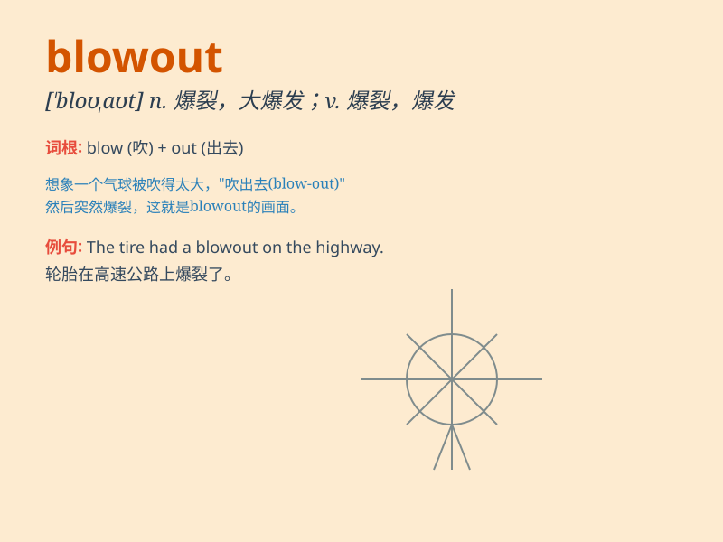

## blowout

**英音:** _[\'bləʊaʊt]_ **美音:** _[\'blo\'aʊt]_

**译义:** *n.(车胎)爆裂,喷出,保险丝烧断,井中喷水或油等*

### 短语

+ **tire blowout:** _轮胎爆裂_

+ **power blowout:** _电力中断_

+ **blowout sale:** _大甩卖；大减价_

+ **oil blowout:** _石油井喷_

+ **gas blowout:** _瓦斯喷出_

### 例句

#### 例句1

> **We had a tire blowout on the highway.**

**中文翻译:** 我们在高速公路上轮胎爆胎了。

**单词释义:** 爆胎

#### 例句2

> **The party was a huge blowout with over a hundred guests.**

**中文翻译:** 这个派对是一场盛大的狂欢，有一百多位宾客。

**单词释义:** 狂欢；盛大的聚会

#### 例句3

> **The oil well had a major blowout, causing an environmental
disaster.**

**中文翻译:** 这口油井发生了重大井喷，造成了环境灾难。

**单词释义:** （油井或气井的）井喷

### 背诵小故事

> One day, I was driving on the highway. Suddenly, my car tyre had a
blowout. It was a scary moment. But luckily, I managed to stop the car
safely. A blowout means a sudden failure of a tyre.

**有一天，我在高速公路上开车。突然，我的汽车轮胎爆胎了。那是个可怕的时刻。但幸运的是，我设法安全地停了车。blowout
意思是轮胎突然爆裂。**

### 图义

