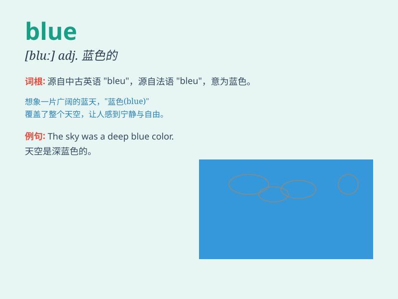

## blue

**英音:** _[bluː]_ **美音:** _[blu]_

**译义:** *n.蓝色adj.蓝色的,忧郁的,沮丧的*

### 短语

+ **blue sky:** _蓝色的天空_

+ **blue eyes:** _蓝色的眼睛_

+ **blueberry:** _蓝莓_

+ **out of the blue:** _突然；出乎意料_

+ **blue mood:** _忧郁的心情_

### 例句

#### 例句1

> **The sky is blue.**

**中文翻译:** 天空是蓝色的。

**单词释义:** 蓝色的

#### 例句2

> **She was feeling blue after the break-up.**

**中文翻译:** 分手后她感到忧郁。

**单词释义:** 忧郁的；沮丧的

#### 例句3

> **He has a blue-collar job.**

**中文翻译:** 他有一份蓝领工作。

**单词释义:** 蓝领的

### 背诵小故事

> One day, a little bird was flying in the blue sky. It was so happy
and free. The blue color of the sky made everything look peaceful and
beautiful. The bird sang a song, enjoying this wonderful blue world.

**有一天，一只小鸟在蓝色的天空中飞翔。它非常开心和自由。天空的蓝色让一切看起来宁静而美丽。小鸟唱着歌，享受着这个美妙的蓝色世界。**

### 图义

