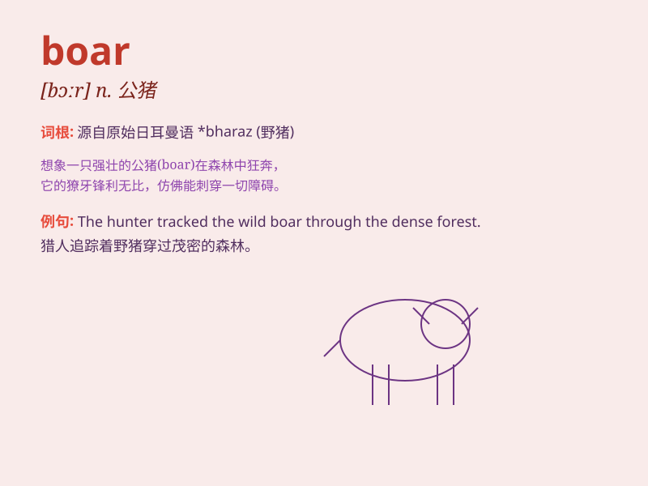

## boar

**英音:** _[bɔː]_ **美音:** _[bɔr]_

**译义:** *n.公猪,野猪,野猪肉*

### 短语

+ **wild boar:** _野猪_

+ **boar hunt:** _猎野猪_

+ **boar bristles:** _野猪鬃毛_

+ **domestic boar:** _家养公猪_

+ **boar tusk:** _野猪獠牙_

### 例句

#### 例句1

> **The boar charged at the hunters.**

**中文翻译:** 这头野猪向猎人冲了过去。

**单词释义:** 野猪

#### 例句2

> **We saw a huge boar in the forest.**

**中文翻译:** 我们在森林里看到了一头巨大的野猪。

**单词释义:** 野猪

#### 例句3

> **The boar was very fierce and difficult to catch.**

**中文翻译:** 这头野猪非常凶猛，很难捕捉。

**单词释义:** 野猪

### 背诵小故事

> A hunter was lost in the forest. Suddenly, a wild boar rushed out.
The boar had sharp tusks and looked fierce. The hunter was scared but
managed to hide. Later, he safely left the forest, never forgetting the
scary boar.

**一位猎人在森林里迷路了。突然，一头野猪冲了出来。这头野猪有着锋利的獠牙，看起来很凶猛。猎人很害怕，但设法躲了起来。后来，他安全地离开了森林，永远忘不了那可怕的野猪。**

### 图义

