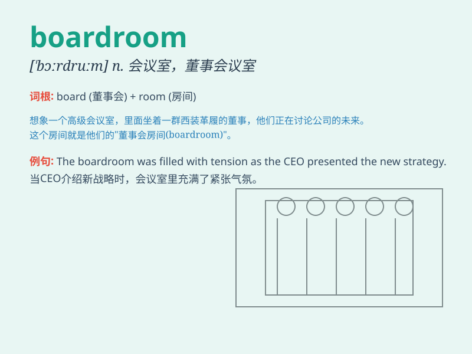

## boardroom

**英音:** _[ˈbɔːdruːm]_ **美音:** _[ˈbɔːrdruːm]_

**译义:** *n.会议室,交换场所*

### 短语

+ **enter the boardroom:** _进入董事会会议室_

+ **boardroom meeting:** _董事会会议_

+ **boardroom discussion:** _董事会讨论_

+ **boardroom decision:** _董事会决策_

+ **boardroom atmosphere:** _董事会氛围_

### 例句

#### 例句1

> **The boardroom was filled with tense discussions about the
company\'s future.**

**中文翻译:** 董事会会议室里充满了关于公司未来的紧张讨论。

**单词释义:** 董事会会议室

#### 例句2

> **He was summoned to the boardroom for an important meeting.**

**中文翻译:** 他被召唤到董事会会议室参加一个重要会议。

**单词释义:** 董事会会议室

#### 例句3

> **The decision was made in the boardroom after hours of debate.**

**中文翻译:** 经过数小时的辩论，这个决定在董事会会议室里做出了。

**单词释义:** 董事会会议室

### 背诵小故事

> A young entrepreneur was nervous as he entered the boardroom for a
crucial meeting. The long table and serious faces made him tense. But he
took a deep breath and presented his ideas bravely.

**一位年轻的企业家走进董事会会议室参加一个关键会议时很紧张。长长的桌子和严肃的面孔让他感到紧张。但他深吸一口气，勇敢地展示了他的想法。**

### 图义

