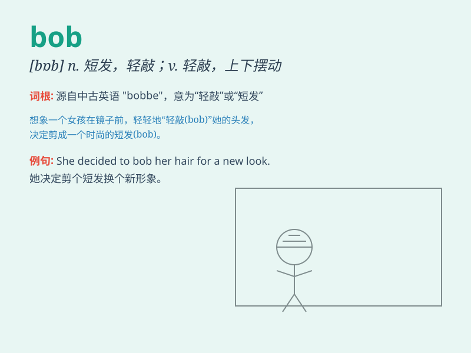

## bob

**英音:** _[bɒb]_ **美音:** _[bɑb]_

**译义:** *v.上下或来回的动,剪短(头发)n.振动,短发,振子锤 Bob
鲍勃(男子名)*

### 短语

+ **bob up:** _突然出现；冒出_

+ **bob around:** _闲荡；到处游荡_

+ **bob hair:** _剪短发；把头发剪短_

+ **bob sled:** _雪橇；大雪橇_

+ **bob in:** _走进；突然进来_

### 例句

#### 例句1

> **Bob is a very friendly person.**

**中文翻译:** 鲍勃是一个非常友好的人。

**单词释义:** 人名，鲍勃

#### 例句2

> **The boat bobbed up and down on the waves.**

**中文翻译:** 小船在波浪中上下颠簸。

**单词释义:** （使）上下移动、晃动

#### 例句3

> **She wore her hair in a bob.**

**中文翻译:** 她留着齐短发。

**单词释义:** 齐短发

### 背诵小故事

> Bob was a little fish who loved to bob up and down in the water. One
day, he saw a beautiful pearl and bobbed quickly to get it. From then
on, whenever he thought of \'bob\', he remembered his adventure.

**鲍勃是一条小鱼，喜欢在水中上下浮动。有一天，它看到一颗美丽的珍珠，快速地上下浮动去获取它。从此，每当它想到'bob'这个词，就会想起这次冒险。**

### 图义

