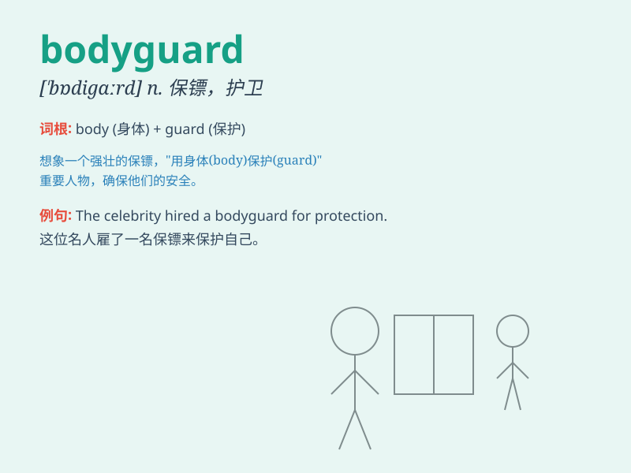

## bodyguard

**英音:** _[\'bɒdɪgɑːd]_ **美音:** _[\'bɑdɪɡɑrd]_

**译义:** *n.保镖,护卫*

### 短语

+ **personal bodyguard:** _私人保镖_

+ **celebrity bodyguard:** _名人保镖_

+ **professional bodyguard:** _专业保镖_

+ **armed bodyguard:** _武装保镖_

+ **full-time bodyguard:** _全职保镖_

### 例句

#### 例句1

> **The celebrity always has a bodyguard by her side.**

**中文翻译:** 明星身边总是有保镖。

**单词释义:** 保镖

#### 例句2

> **The bodyguard protected the politician from the angry crowd.**

**中文翻译:** 保镖保护这位政客免受愤怒人群的伤害。

**单词释义:** 保镖

#### 例句3

> **She hired a professional bodyguard for her trip abroad.**

**中文翻译:** 她为出国旅行聘请了专业保镖。

**单词释义:** 保镖

### 背诵小故事

> A rich man was always in danger. So he hired a strong and brave
person. This person protected the rich man\'s body from any harm. That
person was called a bodyguard.

**一个富人总是处于危险之中。所以他雇了一个强壮勇敢的人。这个人保护富人的身体免受任何伤害。那个人被称为保镖。**

### 图义

