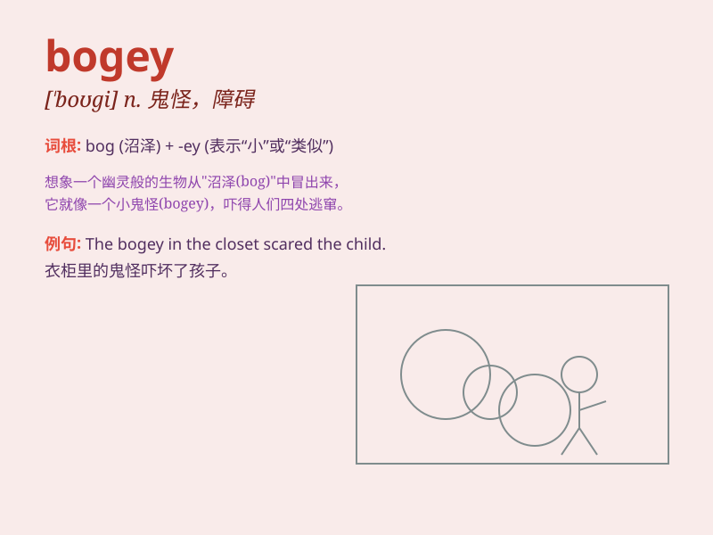

## bogey

**英音:** _[\'bəʊgɪ]_ **美音:** _[\'bogi]_

**译义:** *n.妖怪,可怕的人(物)*

### 短语

+ **bogey man:** _可怕的人；妖怪_

+ **bogey hole:** _小海湾；小洞穴_

+ **bogey team:** _劲敌队伍_

+ **play the bogey:** _扮恶人；吓人_

+ **bogey stroke:** _标准击球数_

### 例句

#### 例句1

> **The golfer managed to avoid the bogey on this difficult hole.**

**中文翻译:** 这位高尔夫球手在这个困难的洞成功地避开了柏忌。

**单词释义:** 高于标准杆一杆

#### 例句2

> **The airplane encountered a bogey on its radar.**

**中文翻译:** 这架飞机在雷达上遇到了敌机。

**单词释义:** 不明飞行物；妖怪

#### 例句3

> **He always thought that the bogey of failure haunted him.**

**中文翻译:** 他一直认为失败的祸根一直困扰着他。

**单词释义:** 困扰人的事物；恐惧

### 背诵小故事

> A golfer was always afraid of hitting the bogey. One day, he faced a
difficult hole and thought it was a bogey. But with courage, he made a
great shot and overcame his fear. Remember, bogey means something
causing fear or trouble.

**一位高尔夫球手总是害怕打出柏忌。有一天，他面对一个困难的球洞，认为这会是个柏忌。但凭借勇气，他打出了漂亮的一杆，克服了恐惧。记住，bogey
指令人害怕或带来麻烦的事物。**

### 图义

