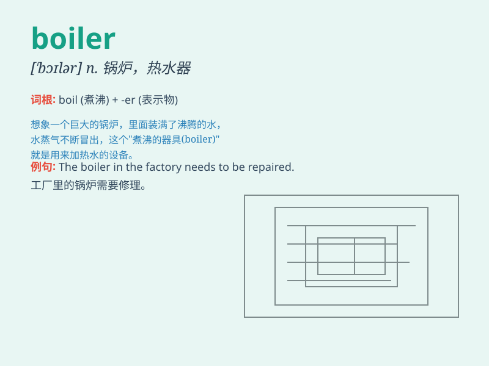

## boiler

**英音:** _[\'bɒɪlə]_ **美音:** _[\'bɔɪlɚ]_

**译义:** *n.煮器(锅,壶的统称),汽锅,锅炉*

### 短语

+ **steam boiler:** _蒸汽锅炉_

+ **boiler room:** _锅炉房；股票欺诈的小公司_

+ **boiler plate:** _样板文件；公式化的文章_

+ **hot water boiler:** _热水锅炉_

+ **industrial boiler:** _工业锅炉_

### 例句

#### 例句1

> **The boiler burst and sent steam shooting through the ceiling.**

**中文翻译:** 锅炉爆裂，蒸汽从天花板喷涌而出。

**单词释义:** 锅炉

#### 例句2

> **We need to get the boiler serviced before winter comes.**

**中文翻译:** 我们需要在冬天到来之前对锅炉进行维修。

**单词释义:** 锅炉

#### 例句3

> **The old boiler was replaced with a new energy-efficient one.**

**中文翻译:** 旧锅炉被更换为新的节能锅炉。

**单词释义:** 锅炉

### 背诵小故事

> A little mouse was very cold. It found a big boiler in an old house.
It climbed in and felt warm at once. The boiler was like a magic box
keeping it cozy.

**一只小老鼠很冷。它在一座老房子里发现了一个大锅炉。它爬进去，立刻就感到温暖了。这个锅炉就像一个神奇的盒子，让它舒适无比。**

### 图义

