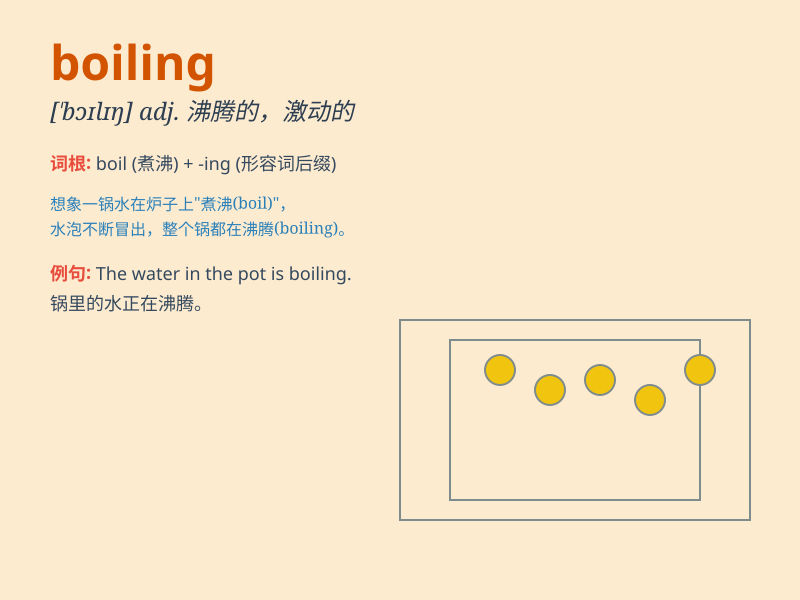

## boiling

**英音:** _[\'bɒɪlɪŋ]_ **美音:** _[\'bɔɪlɪŋ]_

**译义:** *adj.沸腾的,激昂的adv.沸腾*

### 短语

+ **boiling point:** _沸点_

+ **boiling water:** _沸水_

+ **be at the boiling point:** _极度愤怒；情绪激动_

+ **boiling hot:** _滚烫的；酷热的_

+ **keep the pot boiling:** _使保持活跃；使保持进行_

### 例句

#### 例句1

> **The water is boiling. **

**中文翻译:** 水沸腾了。

**单词释义:** 沸腾

#### 例句2

> **It\'s boiling hot today. **

**中文翻译:** 今天天气很热。

**单词释义:** 酷热的

#### 例句3

> **The boiling point of water is 100 degrees Celsius. **

**中文翻译:** 水的沸点是100摄氏度。

**单词释义:** 沸腾的

### 背诵小故事

> 想象一下，你在厨房煮水，水开始冒泡、翻滚，热气腾腾。这就是 boiling
的场景，水达到了非常热、即将沸腾的状态。

**想象在厨房煮水，水冒泡翻滚、热气腾腾的场景来记住'boiling（沸腾的；炎热的）'这个单词。**

### 图义

