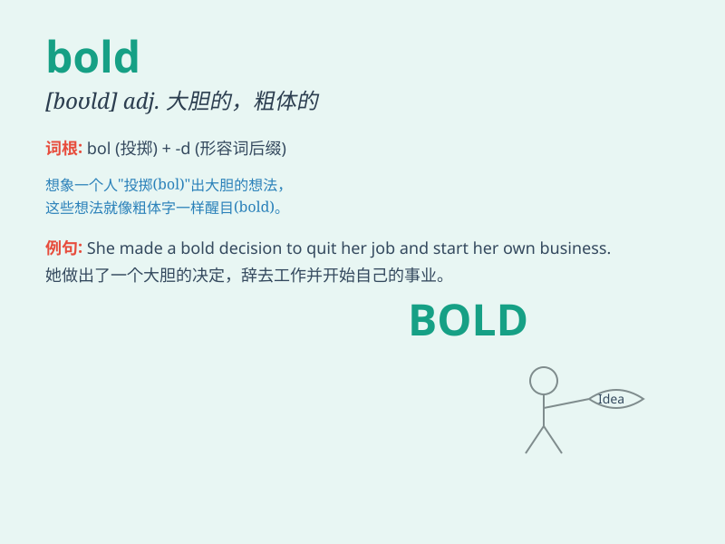

## bold

**英音:** _[bəʊld]_ **美音:** _[bold]_

**译义:** *adj.大胆的n.粗体*

### 短语

+ **bold face:** _黑体字；粗体字_

+ **bold step:** _大胆的步骤_

+ **bold statement:** _大胆的陈述；直言不讳的声明_

+ **bold design:** _大胆的设计_

+ **be bold in:** _敢于；勇于_

### 例句

#### 例句1

> **She was bold enough to stand up against injustice.**

**中文翻译:** 她勇敢地站出来反对不公正。

**单词释义:** 勇敢的

#### 例句2

> **The bold print makes the headline stand out.**

**中文翻译:** 粗体印刷使标题脱颖而出。

**单词释义:** 粗体的

#### 例句3

> **He made a bold move in his career.**

**中文翻译:** 他在职业生涯中迈出了大胆的一步。

**单词释义:** 大胆的

### 背诵小故事

> A little mouse was always afraid. One day, it decided to be bold. It
bravely faced a big cat and didn\'t run away. From then on, it was no
longer timid. Being bold made it stronger.

**一只小老鼠总是很害怕。有一天，它决定勇敢起来。它勇敢地面对一只大猫并且没有逃跑。从那以后，它不再胆小。勇敢使它变得更强大。**

### 图义

