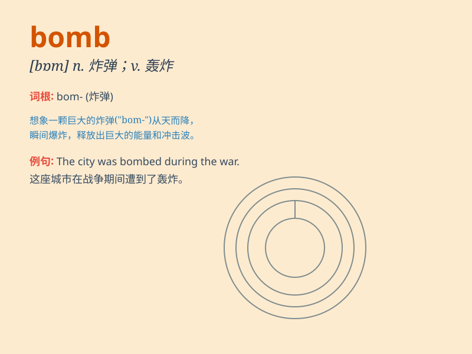

## bomb

**英音:** _[bɒm]_ **美音:** _[bɑm]_

**译义:** *n.炸弹vt.投弹于,轰炸*

### 短语

+ **atomic bomb:** _原子弹_

+ **car bomb:** _汽车炸弹_

+ **bomb attack:** _炸弹袭击_

+ **bomb disposal:** _炸弹拆除_

+ **bomb threat:** _炸弹威胁_

### 例句

#### 例句1

> **The terrorists planted a bomb in the shopping mall.**

**中文翻译:** 恐怖分子在购物中心安放了炸弹。

**单词释义:** 炸弹

#### 例句2

> **The movie bombed at the box office.**

**中文翻译:** 这部电影票房惨败。

**单词释义:** 失败；惨败

#### 例句3

> **The enemy planes bombed the city.**

**中文翻译:** 敌机轰炸了这座城市。

**单词释义:** 轰炸

### 背诵小故事

> A spy was sent to plant a bomb in the enemy\'s base. He sneaked in,
placed the bomb carefully, and then ran away quickly. Just as the enemy
was celebrating, the bomb exploded with a huge bang!

**一名间谍被派去在敌人的基地里放置一枚炸弹。他偷偷潜入，小心地放置了炸弹，然后迅速跑开。就在敌人正在庆祝时，炸弹伴随着一声巨响爆炸了！**

### 图义

